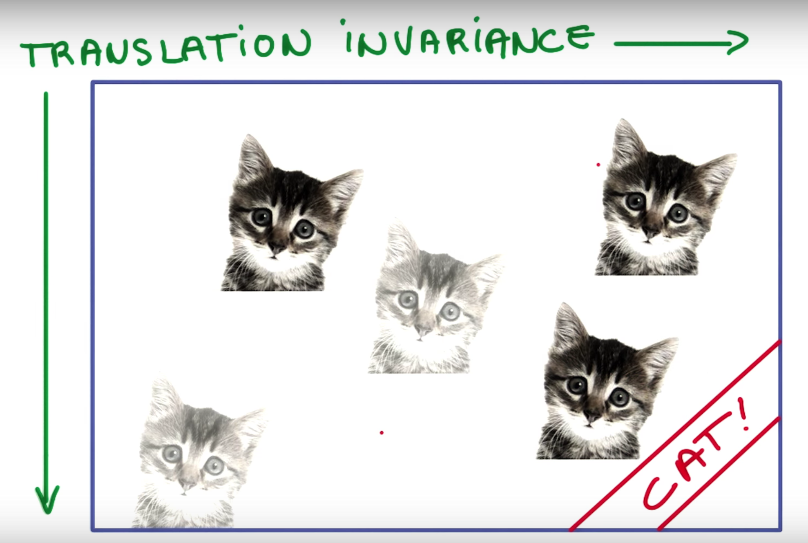
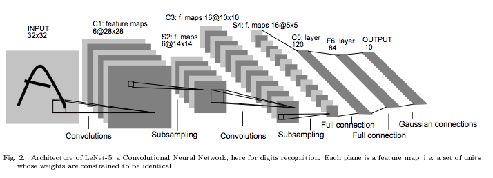

---
---
# Convolutional Neural Networks

::: tip Learning Objectives

- Understand/Refresh the key backgrounds of CNN
- Learn how to apply CNN to healthcare data.

:::

Convolutional Neural Networks (CNNs or ConvNets) are very popular and one of the most successful type of neural networks during the past years with emerging of Deep Learning, especially in Computer Vision. In fact, CNNs are very similar to ordinary neural networks we have seen in the previous chapter: they are made up of neurons that have learnable weights and biases. Each neuron receives some inputs, performs a dot product and optionally follows it with a non-linearity. They are still can be seen as a kind of feed-forward neural networks (no recurrent connections) and all the tips/tricks developed for learning regular neural networks still apply.[1](#f1)

Then, what makes CNNs so popular?

## Convolution

Let's start with reminding us what convolution is. In mathematics, the discrete convolution of 2D data, image for example, <math><mi>f</mi></math> and a 2D finite kernel <math><mi>g</mi></math> is given by  
<math display="block">
    <mo>(</mo><mi>f</mi><mo>*</mo><mi>g</mi><mo>)</mo><mo>(</mo><mi>x</mi><mo>,</mo><mi>y</mi><mo>)</mo><mo>=</mo><munderover><mo>&#x2211;</mo><mrow><mi>v</mi><mo>=</mo><mi>y</mi><mo>-</mo><mi>h</mi></mrow><mrow><mi>y</mi><mo>+</mo><mi>h</mi></mrow></munderover><munderover><mo>&#x2211;</mo><mrow><mi>u</mi><mo>=</mo><mi>x</mi><mo>-</mo><mi>w</mi></mrow><mrow><mi>x</mi><mo>+</mo><mi>w</mi></mrow></munderover><mi>f</mi><mo>(</mo><mi>u</mi><mo>,</mo><mi>v</mi><mo>)</mo><mi>g</mi><mo>(</mo><mi>x</mi><mo>-</mo><mi>u</mi><mo>,</mo><mi>y</mi><mo>-</mo><mi>v</mi><mo>)</mo>
</math>
where <math><mn>2</mn><mi>w</mi><mo>+</mo><mn>1</mn></math> is the width of the kernel and <math><mn>2</mn><mi>h</mi><mo>+</mo><mn>1</mn></math> is the height of the kernel.  
More intuitively, it can be depicted as below

<https://hackernoon.com/visualizing-parts-of-convolutional-neural-networks-using-keras-and-cats-5cc01b214e59>

In this example, 3x3 kernel is applied with stride 1.

## Reduced Parameters

As we can see in the figure above, when we use convolution (layer), each output value (convolved feature in the figure) is not required to connected to every neuron in the previous layer (image in the figure), but only to those, called *receptive fields*, where the colvolution kernel is applied currently. This characteristic of convolution layer is called **Local Connectivity** and it reduces the number of parameters needed dramatically compared to when there is a connection between every single pair of input/output neuron.

In addition, the current weights of the convolution kernel are fixed and those same weights are applied over the convolving until the next update of the parameters. This characteristic of convolution layer is called **Parameter Sharing** and also contributes to the reduced number of parameters. If we want to apply multiple sets of weights, we can just increase the number of kernels (filters).

## Shift Invariant

We can achieve one of the most important features of CNNs, **Shift Invariant**, due to the parameter sharing of convolutional layers and a partial effect from pooling layers. It means that when the input shifts the output also shifts but stays otherwise unchanged. To be specific, if a feature is useful in some locations during training, detectors for that feature will be available in all locations during testing. Look at the following example.

Udacity Course 730, Deep Learning (L3 Convolutional Neural Networks > Convolutional Networks).

If a detector (filter) learnt a useful feature to detect 'CAT', it will capture 'CAT' wherever its location is in an image at testing time.

### About pooling

<https://hackernoon.com/visualizing-parts-of-convolutional-neural-networks-using-keras-and-cats-5cc01b214e59>
As said, we can get a small amount of translational invariance at each level by taking the maximum (or by averaging), a certain number of neighboring replicated detectors (convolved feature here) to give a single output to the next level. This reduces the number of inputs to the next layer of feature extraction, thus allowing us to have many more different feature maps. After several levels of pooling, however, we have lost information about the precise positions of thigns. This makes it impossible to use the precise spatial relationships between high-level parts for recognition. Therefore, sometimes we can see the network architecture that only convolutional layers (with activations) are used without pooling layers.

## Architecture

Overall, CNN or ConvNet is a sequence of Convolutional Layers, interspersed with activation functions, and usually followed by pooling layer. More generally, a CNN is composed by a sequence of several blocks each of which consists of: convolutional - activation - pooling. Several full-connected layers are often stacked on the top of them to build a final output layer. Look at the very classic LeNet5 architecture below.

An example architecture of convolutional neural network (LeNet-5).[2](#f2)
More recent architectures often include more tips and tricks such as dropout, skip connection, bath normalization, and so forth to improve its abilities of approximation and generalization, often with more parameters or computations. You can find a good brief overview of architectures at the reference link of their representative figure below.

 Comparison of architectures.[3](#f3)

It's time!

We will practice the following topics in the tutotial notebook for this chapter on top of what we have covered so far:

- How to construct a class of ConvNet with convolutional layers, pooling layers, and fully-connected layers.
- How to use PyTorch on GPU
- Difference between `train` mode and `eval` mode

We will use Epileptic Seizure Recognition Data Set which is publicly available at [UCI Machine Learning Repository](http://archive.ics.uci.edu/ml/datasets/Epileptic+Seizure+Recognition) for this tutorial. Please try to read the description and download the dataset.

Now, let's start in Notebook **[here](https://github.com/ast0414/CSE6250BDH-LAB-DL/blob/master/2_CNN.ipynb)**

<b id="f1">1</b> [CS231n Convolutional Neural Networks for Visual Recognition, Stanford University](http://cs231n.github.io/convolutional-networks/) [↩](#a1)

<b id="f2">2</b> Lecun, Y., L. Bottou, Y. Bengio, and P. Haffner. 1998. “Gradient-Based Learning Applied to Document Recognition.” Proceedings of the IEEE 86 (11): 2278–2324. [↩](#a2)

<b id="f3">3</b> <https://medium.com/towards-data-science/neural-network-architectures-156e5bad51ba> [↩](#a3)