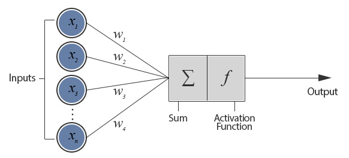

---
---
# Feedforward Neural Networks

::: tip Learning Objectives

- Understand/Refresh the key backgrounds of general neural networks.
- Learn how to implement feed-forward neural networks.

:::

## Artificial Neural Networks

### Perceptron

A very basic and initial form of artificial neural networks (ANN), usually called neural networks (NN) in short, is Perceptron.

 <http://www.theprojectspot.com/tutorial-post/introduction-to-artificial-neural-networks-part-1/7> 

Perceptron algorithm is very simple. It sums up the weighted inputs and a bias, then applies an activation function such as sigmoid or tanh, as it is shown in the figure above. The weights and the bias of a perceptron can be learnt by using Peceptron Learning Rule (PLR) or Delta Rule.

The perceptron shown above consists of a single 'layer' as it has only one layer of weighted connection between input units and output unit(s). Single-layer perceptrons (SLP) can be considered as the simplest **feed-forward network** and SLPs are only capable of learning linearly separable patterns such as 'OR' logical function. XOR functions is a simple representative problem that SLP cannot learn.

### Multi-layer Perceptron

We can extend perceptron to have multiple layers - input layer, hidden layer(s), and output layer - and they are called multi-layer perceptron (MLP). An example of MLP with one hidden layer is shown below.

It is known that even a single hidden layer is sufficient to make MLPs a universal function approximator, which means single hidden layer MLPs can learn any function theoritically. However, we can experience that there are substantial benefits to using many hidden layers which is directly connected to the premise of **deep learning**.[1](#f1) It is usally said that networks are *shallow* if they have one hidden layer, *deep* if they have multiple hidden layers. 

For training a MLP, the weights and the biases are updated by using **Back-propagation** with gradient based optimization algorithms such as SGD, RMSProp, Adam, and so forth. It is very important and essential for all types of neural networks. Explaining the details of back-propagation, however, is out of the scope of this tutorial. Please refer to Machine Learning class materials if you are not familiar with these terms yet.

We will practice the following topics in the tutotial notebook for this chapter:

- Basic usage of TensorDataset and DataLoader in Pytorch
- How to define a python class to construct neural network
- Loss function and Optimizer
- Basic trining iteration

Let's start in Notebook **[here](https://github.com/ast0414/CSE6250BDH-LAB-DL/blob/master/1_FeedforwardNet.ipynb)**

<b id="f1">1</b> <http://deeplearning.net/tutorial/mlp.html>. [↩](#a1)