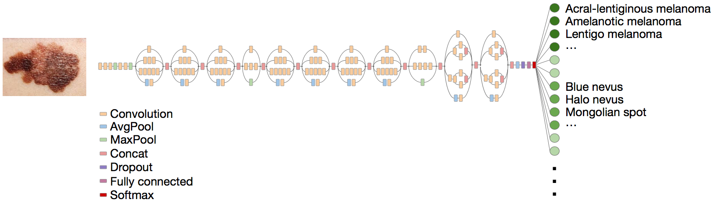
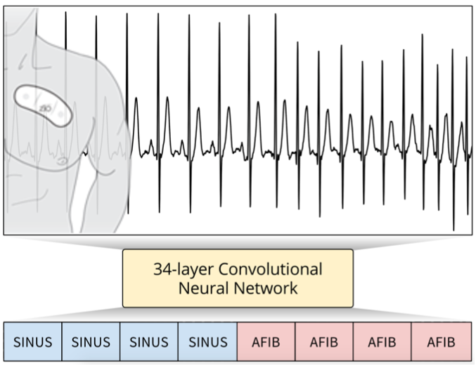

---
---
# Deep Learning for Healthcare

Deep learning techniques are widely used in many domains such as Computer Vision, Natural Language Processing, Speech Recognition, and so forth with their great performances.

Empowered by a massive amount of healthcare data such as Electronic Health Records (EHR) or insurance claims data, deep learning techniques have been applied for healthcare applications also and have achieved succesful results [1](#f1),[2](#f2),[3](#f3), even though there are some challenges different from other areas.

 Classification of skin cancer with a fine-tuned Google Inception v3 CNN architecture.[1](#f1)

 Arrhythmia Detection with Convolutional Neural Networks.[3](#f3)

Throughout the series of the lab sessions, we will introduce some deep learning approches, a varity of neural networks, and practices with healthcare data examples. Enjoy!

<b id="f1">1</b> Esteva, Andre, Brett Kuprel, Roberto A. Novoa, Justin Ko, Susan M. Swetter, Helen M. Blau, and Sebastian Thrun. 2017. “Dermatologist-Level Classification of Skin Cancer with Deep Neural Networks.” Nature 542 (7639). Nature Research: 115–18. [↩](#a1)

<b id="f2">2</b> Gulshan, Varun, Lily Peng, Marc Coram, Martin C. Stumpe, Derek Wu, Arunachalam Narayanaswamy, Subhashini Venugopalan, et al. 2016. “Development and Validation of a Deep Learning Algorithm for Detection of Diabetic Retinopathy in Retinal Fundus Photographs.” JAMA: The Journal of the American Medical Association 316 (22). jamanetwork.com: 2402–10. [↩](#a2)

<b id="f3">3</b> Pranav Rajpurkar, Awni Y. Hannun, Masoumeh Haghpanahi, Codie Bourn, and Andrew Y. Ng. 2017. “Cardiologist-Level Arrhythmia Detection with Convolutional Neural Networks.” arXiv [cs.CV]. arXiv. <http://arxiv.org/abs/1707.01836>. [↩](#a3)

<!---
<b id="f1">1</b> REFERENCE [↩](#a1)
-->