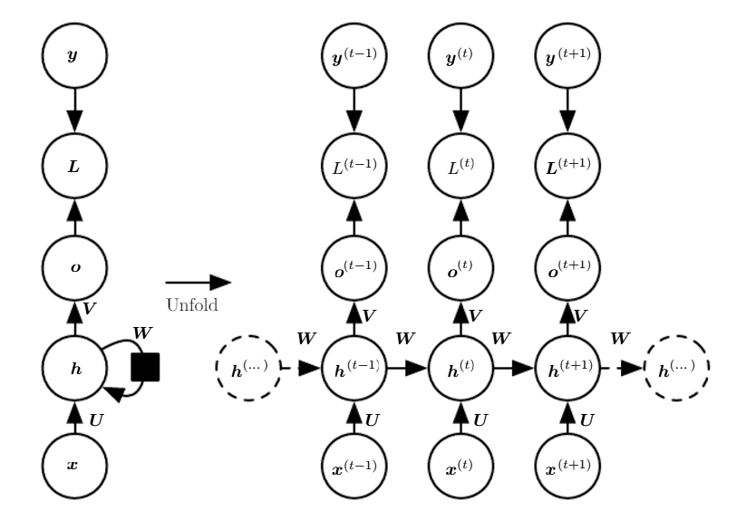
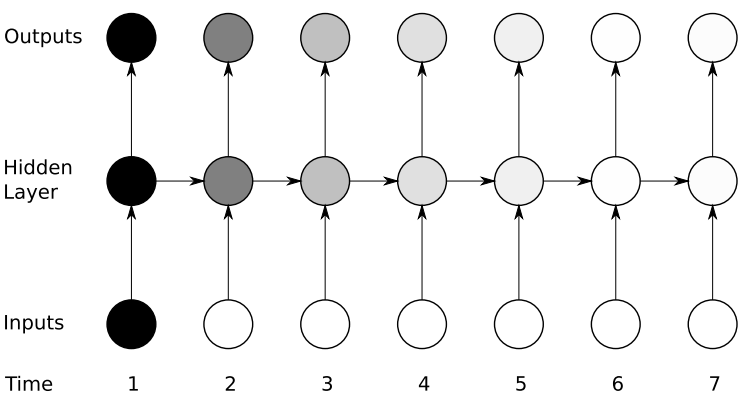
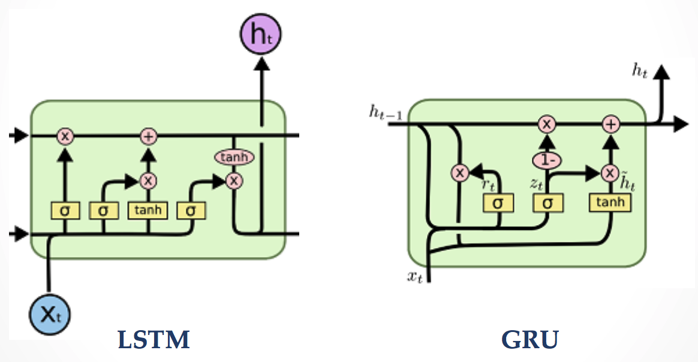
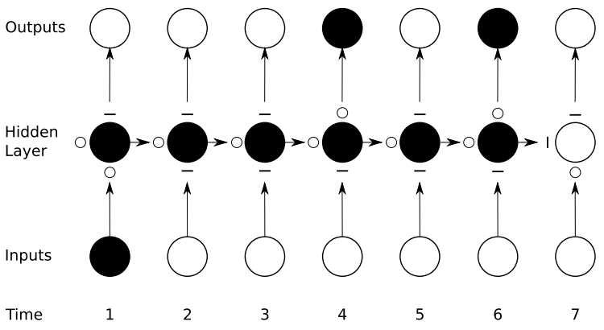

---
---
# Recurrent Neural Networks

::: tip Learning Objectives

- Understand/Refresh the key backgrounds of RNN
- Learn how to apply RNN to healthcare data.

:::

## Recurrent Neural Networks

Many applications exhibited by dynamically changing states such as video frames, language (sentences), speech signals, and healthcare data with sequences of visits or time-stamped data.  
More generally, we can divide into multiple categories according to their inputs/outputs types as follows.
 Andrej Karpathy blog <http://karpathy.github.io/2015/05/21/rnn-effectiveness/>
For examples of healthcare data, we can think of the following types of data and tasks, but not limited to:

- **one-to-one**: a classification task with aggregated feature vector for each patient
- **many-to-one**: a classification task with multiple visit data or time-series for each patient
- **many-to-many**: a disease progression modeling (DPM) type of task

Of course, sequence type of data can be also dealt with regular (feed-forward) neural networks with some modifications such as concatenating all elements of sequence into one long vector. For many applications, however, it is inefficient or a very bad idea since the temporal information is completely ignored while it may contains very meaningful information. On the other hand, recurrent neural networks have *recurrent* connections ,as it is named, between time steps to *memorize* what has been calculated so far in the network. Let's take a look at the figure below

Time-unfolded recurrent neural network.[1](#f1)
where <math><mi>x</mi></math>, <math><mi>h</mi></math>, <math><mi>o</mi></math>, <math><mi>L</mi></math>, and <math><mi>y</mi></math> are input, hidden, output, loss, and target values respectively.
We can see in the left graph, there is a recurrent connection of hidden-to-hidden itself via weight matrix <math><mi>W</mi></math> and the information that captures the computation history is passed through this connection.

Meanwhile, we can rearrange it as a special type of feedforward network by unfolding it over the time as depicted in the right graph. Therefore, we can also apply backpropagation algorithm to calculate gradients on the unfolded computational graph, which is called **back-propagation through time (BPTT)**. We will not cover the details of it as it is out of the scope of this tutorial. Please refer to Machine Learning or Deep Learning class materials.

<!--
<math xmlns="http://www.w3.org/1998/Math/MathML">
  <mtable columnalign="right left right left right left right left right left right left" rowspacing="3pt" columnspacing="0em 2em 0em 2em 0em 2em 0em 2em 0em 2em 0em" displaystyle="true">
    <mtr>
      <mtd>
        <msup>
          <mrow class="MJX-TeXAtom-ORD">
            <mi mathvariant="bold">a</mi>
          </mrow>
          <mrow class="MJX-TeXAtom-ORD">
            <mo stretchy="false">(</mo>
            <mi>t</mi>
            <mo stretchy="false">)</mo>
          </mrow>
        </msup>
      </mtd>
      <mtd>
        <mi></mi>
        <mo>=</mo>
        <mrow class="MJX-TeXAtom-ORD">
          <mi mathvariant="bold">b</mi>
        </mrow>
        <mo>+</mo>
        <mrow class="MJX-TeXAtom-ORD">
          <mi mathvariant="bold">W</mi>
        </mrow>
        <msup>
          <mrow class="MJX-TeXAtom-ORD">
            <mi mathvariant="bold">h</mi>
          </mrow>
          <mrow class="MJX-TeXAtom-ORD">
            <mo stretchy="false">(</mo>
            <mi>t</mi>
            <mo>&#x2212;</mo>
            <mn>1</mn>
            <mo stretchy="false">)</mo>
          </mrow>
        </msup>
        <mo>+</mo>
        <mrow class="MJX-TeXAtom-ORD">
          <mi mathvariant="bold">U</mi>
        </mrow>
        <msup>
          <mrow class="MJX-TeXAtom-ORD">
            <mi mathvariant="bold">x</mi>
          </mrow>
          <mrow class="MJX-TeXAtom-ORD">
            <mo stretchy="false">(</mo>
            <mi>t</mi>
            <mo stretchy="false">)</mo>
          </mrow>
        </msup>
      </mtd>
    </mtr>
    <mtr>
      <mtd>
        <msup>
          <mrow class="MJX-TeXAtom-ORD">
            <mi mathvariant="bold">h</mi>
          </mrow>
          <mrow class="MJX-TeXAtom-ORD">
            <mo stretchy="false">(</mo>
            <mi>t</mi>
            <mo stretchy="false">)</mo>
          </mrow>
        </msup>
      </mtd>
      <mtd>
        <mi></mi>
        <mo>=</mo>
        <mi>tanh</mi>
        <mo>&#x2061;</mo>
        <mo stretchy="false">(</mo>
        <msup>
          <mrow class="MJX-TeXAtom-ORD">
            <mi mathvariant="bold">a</mi>
          </mrow>
          <mrow class="MJX-TeXAtom-ORD">
            <mo stretchy="false">(</mo>
            <mi>t</mi>
            <mo stretchy="false">)</mo>
          </mrow>
        </msup>
        <mo stretchy="false">)</mo>
      </mtd>
    </mtr>
    <mtr>
      <mtd>
        <msup>
          <mrow class="MJX-TeXAtom-ORD">
            <mi mathvariant="bold">o</mi>
          </mrow>
          <mrow class="MJX-TeXAtom-ORD">
            <mo stretchy="false">(</mo>
            <mi>t</mi>
            <mo stretchy="false">)</mo>
          </mrow>
        </msup>
      </mtd>
      <mtd>
        <mi></mi>
        <mo>=</mo>
        <mrow class="MJX-TeXAtom-ORD">
          <mi mathvariant="bold">c</mi>
        </mrow>
        <mo>+</mo>
        <mrow class="MJX-TeXAtom-ORD">
          <mi mathvariant="bold">V</mi>
        </mrow>
        <msup>
          <mrow class="MJX-TeXAtom-ORD">
            <mi mathvariant="bold">h</mi>
          </mrow>
          <mrow class="MJX-TeXAtom-ORD">
            <mo stretchy="false">(</mo>
            <mi>t</mi>
            <mo stretchy="false">)</mo>
          </mrow>
        </msup>
      </mtd>
    </mtr>
    <mtr>
      <mtd>
        <msup>
          <mrow class="MJX-TeXAtom-ORD">
            <mover>
              <mrow class="MJX-TeXAtom-ORD">
                <mi mathvariant="bold">y</mi>
              </mrow>
              <mo stretchy="false">&#x005E;</mo>
            </mover>
          </mrow>
          <mrow class="MJX-TeXAtom-ORD">
            <mo stretchy="false">(</mo>
            <mi>t</mi>
            <mo stretchy="false">)</mo>
          </mrow>
        </msup>
      </mtd>
      <mtd>
        <mi></mi>
        <mo>=</mo>
        <mtext>softmax</mtext>
        <mo stretchy="false">(</mo>
        <msup>
          <mrow class="MJX-TeXAtom-ORD">
            <mi mathvariant="bold">o</mi>
          </mrow>
          <mrow class="MJX-TeXAtom-ORD">
            <mo stretchy="false">(</mo>
            <mi>t</mi>
            <mo stretchy="false">)</mo>
          </mrow>
        </msup>
        <mo stretchy="false">)</mo>
      </mtd>
    </mtr>
  </mtable>
</math>
-->

### Vanishing Gradient

Even though we can train RNNs efficiently by using BPTT, there exists a crucial limitation in the vanilla RNN architecture (in fact, it is not only for RNNs but for all types of neural networks if they are very deep). The problem is that the influence of an input on the hidden layers, and therefore on the output, either decays or blows up exponentially as it cycles around the recurrent connections since most activation functions such as sigmoid or tanh are bounded. Thie phenomenon is called *vanishing gradient* problem.  

The vanishing gradient problem for RNNs.[2](#f2)  
As we can see in the figure above, the amount of influence decreases over time as new inputs overwrite the activations of the hidden layer, and the network ‘forgets’ the first inputs. As a result, it is difficult to learn long-term dependencies of sequences with the vanilla architecture RNNs.

### Gated RNNs

LSTM and GRU. (images from colah's blog <http://colah.github.io/posts/2015-08-Understanding-LSTMs>)  
There can be a few options to attenuate the vanishing gradient effect, e.g. using non-saturated activations such as ReLU rather than saturated activations. The most preferred and popular one is using gated architecture for RNNs to control absorbing/forgetting the information. Long Short-Term Memory networks (LSTMs)[3](#f3) were introduced in 1997 and work really well even on problems learning from very long-term dependencies. One of the most popular variants of LSTM is Gated Recurrent Units (GRU)[4](#f4) which has fewer gates (parameters) than LSTM. The performances of these two gated architectures are varying by problem. 

As illustrated in the following figure, gated RNNs (learn to) control their gates to remember/forget the information from the past, and therefore they are less suffer from the vanishing gradient effect. 

Preservation of gradient information by LSTM. Input, forget, ourput gates are located below, left, and above the hidden unit respectively and are depicted by <math><mo>&#x25CB;</mo></math> for 'open' and <math><mo>&#xFF0D;</mo></math> for 'close'.  

Let's try to apply them into our domain, healthcare problems.  
We will practice the following topics in the tutotial notebook for this chapter on top of what we have covered so far:

- Preparing data in a proper shape for RNN
- How to use Recurrent Layer modules in PyTorch

Same as the previous chapter, we will use Epileptic Seizure Recognition Data Set which is publicly available at [UCI Machine Learning Repository](http://archive.ics.uci.edu/ml/datasets/Epileptic+Seizure+Recognition) for this tutorial.

Now, let's start in Notebook **[here](https://github.com/ast0414/CSE6250BDH-LAB-DL/blob/master/3_RNN.ipynb)**

<b id="f1">1</b> [Goodfellow, I., Y. Bengio, and A. Courville. 2016. “Deep Learning”, Chapter 10.](http://www.deeplearningbook.org/contents/rnn.html) [↩](#a1)  
<b id="f2">2</b> A. Graves. 2012. “Supervised Sequence Labelling with Recurrent Neural Networks”, Chapter 4. [↩](#a2)  
<b id="f3">3</b> Hochreiter, Sepp, and Jürgen Schmidhuber. 1997. “Long Short-Term Memory.” Neural Computation 9 (8). Cambridge, MA, USA: MIT Press: 1735–80. [↩](#a3)  
<b id="f4">4</b> Chung, Junyoung, Caglar Gulcehre, Kyunghyun Cho, and Yoshua Bengio. 2014. “Empirical Evaluation of Gated Recurrent Neural Networks on Sequence Modeling.” arXiv [cs.NE]. arXiv. http://arxiv.org/abs/1412.3555. [↩](#a4)
