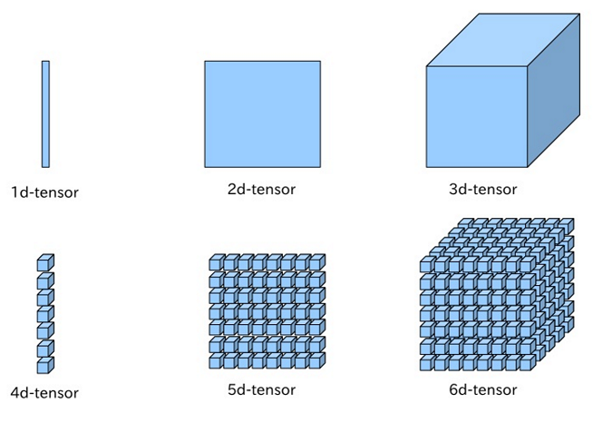

---
---
# Getting Started

::: tip Learning Objectives

- Learn basic usage of deep learning frameworks.

:::

## PyTorch

PyTorch is a python package that provides two high-level features:[1](#f1)

- Tensor computation like numpy with strong GPU acceleration
- Deep Neural Networks built on a tape-based autograd system

### Tensor

If you have ever used numpy in Python, you already have used Tensors (a.k.a ndarray)[1](#f1)

Image by <https://leonardoaraujosantos.gitbooks.io/artificial-inteligence/content/linear_algebra.html>

PyTorch provides Tensors that can be created and manipulated on both CPU and GPU. Also, it is easy to convert numpy ndarray to PyTorch Tensor and vice versa.

### Dynamic Graph

One of the advantages PyTorch has is that it uses dynamic computation graph. On the other hand, most of other deep learning frameworks such as TensorFlow, Theano, Caffe, and CNTK use a static computation graph. Thus, we need to define and compile the network completely before actually using (traininig) it. With PyTorch, however, we can change the way the network behaves arbitratily.

pytorch.org

We will learn the following topics in this chapter:

- Pytorch Tensor
- Converting between Tensor and ndarray (Numpy)
- Indexing and Math operations
- GPU Acceleration
- Automatic differentiation with Variable

Let's get started with some examples **[here!](https://github.com/ast0414/CSE6250BDH-LAB-DL/blob/master/0_Intro_PyTorch.ipynb)**

<b id="f1">1</b> [PyTorch](http://pytorch.org/about/) [↩](#a1)

<!---
<b id="f1">1</b> REFERENCE [↩](#a1)
-->