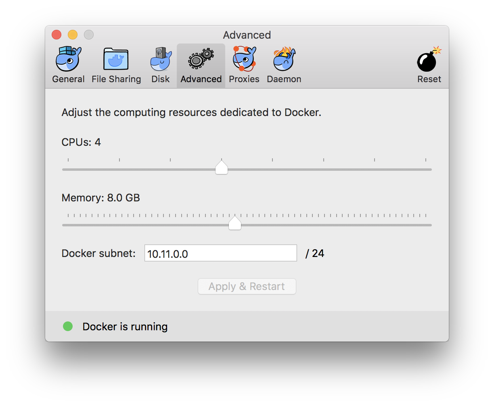

---
---
# Install Docker In macOS

If you are using macOS, you are supposed to prepare a virtual machine/service to host a real Linux instance, and then control it in the remote.

Currently, there are at least 2 solutions to achieve it.

## Option One:  Docker.app

If you are using macOS, you could follow [this guide](https://docs.docker.com/docker-for-mac/install/). Download an image, and drag to your 'Applications' folder, click and run.

+ [Stable channel](https://download.docker.com/mac/stable/Docker.dmg)
+ [Edge channel](https://download.docker.com/mac/edge/Docker.dmg)

Currently, both of them are working pretty fine. 

+ Kubernetes is only available in Docker for Mac 17.12 CE Edge and higher, on the Edge channel. 
+ Edge can not disable "Sending usage statistics"
+ [For more](https://docs.docker.com/docker-for-mac/faqs/#questions-about-dockerapp)

Either of them could satisfy the requirements in this course.

If you wish to host our image using Docker.app, you are supposed to click the icon for docker in the toolbar, and set the maximum memory to 4G-8G.




Docker.app requires sudo access, and the data will stored in `$HOME/Library/Containers/com.docker.docker`


## Option Two: Homebrew + VirtualBox + Docker

However, here is an alternative solution.

First of all, you should make sure you have already installed [HomeBrew](http://brew.sh/).

Secondly, you are supposed to make sure your brew is up-to-date.

```bash
brew update # update brew repository
brew upgrade # update all packages for brew
brew doctor # check the status of your brew, it will provide some guide to make your brew be normal
```

Finally, you can install VirtualBox and Docker by using the following commands:

```bash
brew install Caskroom/cask/virtualbox
brew install docker-machine
brew install docker
```

To keep the Docker service active, we can use brew's service manager

```
$ brew services start docker-machine
==> Successfully started `docker-machine` (label: homebrew.mxcl.docker-machine)
```

Check the status:

```
$ brew services list
Name           Status  User Plist
docker-machine started name   /Users/name/Library/LaunchAgents/homebrew.mxcl.docker-machine.plist
```

Create a default instance using the following command:

```bash
docker-machine create --driver virtualbox --virtualbox-memory 8192  default
```

Please refer to [this link](https://docs.docker.com/machine/reference/create/) for some detail instruction.

Every time you created a new terminal window, and before you execute any command of 'docker *', you are supposed to run the following command:

```bash
eval $(docker-machine env default)
```

This command will append some environment variables to your current sessions.

### FAQ

##### **Q:** Can not connect to docker

Error Message:

```
$ docker ps -a
Cannot connect to the Docker daemon at unix:///var/run/docker.sock. Is the docker daemon running?
```

Please make sure you have already started your session.

##### **Q:** Start docker-machine Failed, Can Not Get IP Address

The default manager by vbox is conflict with vpn [AnyConnect](https://faq.oit.gatech.edu/content/how-do-i-get-started-campus-vpn), if you are using it, just disconnect it.

##### **Q:** Invalid Active Developer Path

```
xcrun: error: invalid active developer path (/Library/Developer/CommandLineTools), missing xcrun at: /Library/Developer/CommandLineTools/usr/bin/xcrun
Error: Failure while executing: git config --local --replace-all homebrew.analyticsmessage true
```

try `xcode-select --install` and then `brew update`, `brew upgrade`, and `brew doctor` again

##### **Q:** Where are the data for the images and hard disks?

They are in `$HOME/.docker`


