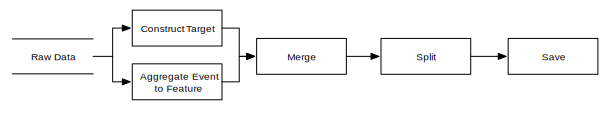
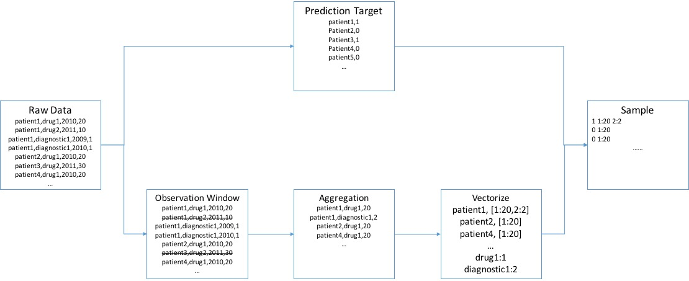
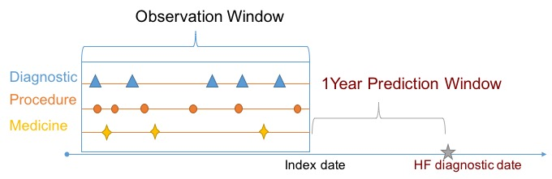

---
---
# Hadoop Pig

::: tip

- Learn how to work with Pig interactive shell.
- Understand Pig Latin data types and Pig relations.
- Learn to implement data processing scripts in Pig Latin.
- Learn to write user defined functions (UDFs).

:::

The goal of this module is to show you how to construct feature vectors from the [raw event sequences data](/data.html) through [Hadoop Pig](http://pig.apache.org/), a high-level data processing tool which runs on top of Hadoop MapReduce. Instead of writing a Java program, you will write a high level script using Pig Latin and let the framework translate it into MapReduce jobs for you.

Throughout this training, you will learn how to run Pig both interactively and in script (batch) mode. We will first demonstrate basic knowledge of Pig's _interactive shell_ and _data types_, then show how to complete the feature construction task step by step. The high-level process of feature construction is depicted below:



## Interactive Shell

Pig provides a shell to manipulate data interactively. Let's start a shell and run that in local mode for demo purpose

``` bash
> cd bigdata-bootcamp/sample/pig
> pig -x local
```

and you will see the prompt as

```bash
[info] ...
grunt>
```

Next, you can input a Pig Latin **statement**, the basic construct for using Pig. For example,

```bash
grunt> case_events = LOAD 'data/case.csv' USING PigStorage(',') AS (patientid:chararray, eventname:chararray, dateoffset:int, value:double);
```

Here we call the `case_events` a [**relation**](http://pig.apache.org/docs/r0.14.0/basic.html#relations) in Pig Latin. In this statement, we load data from the `data/case.csv` file into the `case_events` relation. We also specify the [**schema**](http://pig.apache.org/docs/r0.14.0/basic.html#schemas) of the data as

```
(patientid:chararray, eventname:chararray, dateoffset:int, value:double)
```

which defines a four-field tuple with names and types of each field corresponding to our raw data. Here we use `PigStorage`, the most common adapter in Pig to load/save data from/into a file system (including HDFS). Of course you can load data from other sources (such as databases) using other `Storage` interfaces.

You can check the schema using the `DESCRIBE` operator

```bash
grunt> DESCRIBE case_events;
case_events: {patientid: chararray,eventname: chararray,dateoffset: int,value: double}
```

and collect display data with `DUMP`

```bash
grunt> DUMP case_events;
...
(021FB39310BC3797,DRUG67544054730,1352,30.0)
(021FB39310BC3797,DRUG00002021008,1391,10.0)
(021FB39310BC3797,DRUG63304073705,1393,30.0)
(021FB39310BC3797,DRUG36987235901,1456,30.0)
(021FB39310BC3797,DRUG55154239805,1456,10.0)
```

::: warning

##### Limit Output

Sometimes, `DUMP` will generate a lot of output but you may just want to see a few examples. Pig itself doesn't have an operator like _head_; instead you can run a command like

```bash
tmp = LIMIT A 10;
DUMP tmp;
```

to print the top 10 items in relation `A`.

:::

::: tip

##### About Lazy Evaluation

Pig will not run immediately after you input a statement. Only when you need to `save` or `dump` will Pig actually run. The good part of this property is that internally Pig can be optimized. A potential problem is that you may not realize you have made a mistake until you reach a later statement that has output. If you are not sure, on a small data set, you can `dump` frequently.

:::

The shell also provides other commands. Important ones include (but are not limited to)

1. `fs`: serves the same purpose as `hdfs dfs`, so that you can type `fs -ls` directly in the Pig shell instead of `hdfs dfs -ls`.
2. `pwd`: prints the present working directory (useful in debugging 'file not found' errors).

Type `help` in  the Pig shell to learn more about these commands. Pig operators covered in later examples are listed in the table below; please refer to [Pig Official Documentation](https://pig.apache.org/docs/r0.11.1/basic.html#Relational+Operators) to learn more.

| Operator  | Explanation |
| :------------- | :------------- |
| DISTINCT  | Removes duplicate tuples in a relation  |
| FILTER | Selects tuples from a relation based on some condition|
|FOREACH|Generates data transformations based on columns of data|
|GROUP| Groups the data in one or more relations|
| JOIN (inner)| Performs an inner join of two or more relations based on common field values| 
|LIMIT | Limits the number of output tuples|
|LOAD| Loads data from the file system|
|ORDER BY| Sorts a relation based on one or more fields|
|RANK| Returns each tuple with the rank within a relation|
|SPLIT| Partitions a relation into two or more relations|
|STORE|Stores or saves results to the file system|
|UNION| Computes the union of two or more relations, does not eliminate duplicate tuples|
|REGISTER |Registers a JAR file so that the UDFs in the file can be used|
Finally, type `quit` to leave the shell.

## Data type

In this section, we briefly describe data types. Pig can work with simple types like `int`, `double`. More important types are `tuple` and `bag`.

**Tuple** is usually represented by `()`. For example,

```
(021FB39310BC3797,DRUG55154239805,1456,10.0)
```

In Pig Latin, we can either fetch fields by index (like `$0`) or by name (like `patientid`). With index we can also fetch a range of fields. For example `$2..` means "all fields from the _2_-nd to the last."

**Bag** is usually denoted with `{}`. From the result of `DESCRIBE case_events` we can see that `case_events` itself is a bag. You can regard a bag as a special unordered `set` that doesn't check for duplicates (a multiset).

Check out the [official documentation about data types](http://pig.apache.org/docs/r0.14.0/basic.html#Data+Types+and+More) for more. You will find examples of different types in the samples below. Pay attention to the result of `DESCRIBE` where you will find types and names of fields.

## Feature construction

Next, you will learn by practicing how to construct features for predictive modeling. You will learn how to use built-in operators like `GROUP BY` and `JOIN` as well as how to create User Defined Functions (UDFs) in python. The result of feature construction will be a feature matrix that can be used by a lot of machine learning packages.

### Overview

Feature construction works as shown below, where sample data format of each step is depicted.


We start by loading the raw data. Then we extract the prediction target (i.e. whether the patient will have heart failure or not). Next, we filter and aggregate events of patient into features. After that we need to associate the prediction target and feature vectors to generate complete training/testing samples. Finally we split the data into training and testing sets and save.

### Load data

First, make sure you are in `bigdata-bootcamp/sample/pig` folder and check availability of the raw data file with:

```bash
grunt> pwd
file:/path/to/bigdata-bootcamp/sample/pig
grunt> ls data
file:/path/to/bigdata-bootcamp/sample/pig/data/case.csv<r 1>    536404
file:/path/to/bigdata-bootcamp/sample/pig/data/control.csv<r 1> 672568
grunt>
```

Then, let's load the data as a `relation`:

```bash
grunt> events = LOAD 'data/' USING PigStorage(',') AS (patientid:chararray, eventname:chararray, dateoffset:int, value:int);
```

### Extract target date and filter events

Our data set can be used for predicting heart failure (HF), and we want to predict heart failure one year before it happens. This one-year delay between our observations and our prediction target is the prediction window, as illustrated in the figure below.



We will need to find the HF diagnostic date and use that date to filter out events within the prediction window. We do this using the heart failure event date. All patients will have an HF event, but for `case` patients the event value will be `1` (meaning HF occurred), while for `control` patients the event value is 0 as there's no HF.

```bash
grunt> targets = FILTER events BY eventname == 'heartfailure';
grunt> event_target_pairs = JOIN events BY patientid, targets BY patientid;
grunt> filtered_events = FILTER event_target_pairs BY (events::dateoffset <= targets::dateoffset - 365);
```

After `JOIN` we have some redundant fields that we will no longer need, so we can project `filtered_events` into a simpler format:

```bash
grunt> filtered_events = FOREACH filtered_events GENERATE $0 AS patientid, $1 AS eventname, $3 AS value;
```

Notice that as dateoffset is no longer useful after filtering, we dropped it from the projection.

### Aggregate events into features

#### Illustrative sample

Our raw data is an event sequence. In order to aggregate that into features suitable for machine learning, we can **sum** up values for each event type into a single feature value corresponding to the given event. We will directly use the event name as the name of the corresponding feature. For example, given the raw event sequence for a patient with ID `FBFD014814507B5C` below:

```
FBFD014814507B5C,PAYMENT,1220,30.0
FBFD014814507B5C,DIAGE887,1321,1.0
FBFD014814507B5C,PAYMENT,1321,1000.0
FBFD014814507B5C,DIAGE887,907,1.0
FBFD014814507B5C,DRUG52959072214,1016,30.0
```

We can get a (feature name, value) pair for this patient as

```
(PAYMENT, 1030.0)
(DIAGE887, 2.0)
(DRUG52959072214, 30.0)

```

#### Code

The code below will aggregate `filtered_events` from the [previous filter step](#extract-target-and-filter) into tuples in `(patientid, feature name, feature value)` format:

```bash
grunt> feature_name_values = GROUP filtered_events BY (patientid, eventname);
grunt> DESCRIBE feature_name_values;
feature_name_values: {group: (patientid: chararray,eventname: chararray),filtered_events: {(patientid: chararray,eventname: chararray,value: int)}}
grunt> feature_name_values = FOREACH feature_name_values GENERATE group.$0, group.$1 as featurename, SUM(filtered_events.value) AS value;
grunt> DESCRIBE feature_name_values
feature_name_values: {patientid: chararray,featurename: chararray,value: long}
grunt> DUMP feature_name_values;
...
(FBFD014814507B5C,DIAG38845,1)
(FBFD014814507B5C,DIAGV6546,1)
(FBFD014814507B5C,DRUG00008251302,30)
(FBFD014814507B5C,DRUG52959072214,30)
```

### Assign integer-ID to feature

#### Get unique feature-ID

In a machine learning setting, we want to assign an index to each different feature rather than using its name directly. For example, DIAG38845 corresponds to feature-id=1 and DIAGV6546 corresponds to feature-id=2.

The code below is used to extract unique feature names using the `DISTINCT` operator and assign an index to each feature name with `RANK` operator.

```bash
grunt> feature_names = FOREACH feature_name_values GENERATE featurename;
grunt> feature_names = DISTINCT feature_names;
grunt> feature_name_index = RANK feature_names;
grunt> feature_name_index = FOREACH feature_name_index GENERATE $0 AS index, $1;
grunt> DESCRIBE feature_name_index 
feature_name_index: {index: long,featurename: chararray}
grunt> DUMP feature_name_index;
...
(9973,DRUG81306041113)
(9974,DRUG91899051572)
(9975,DRUG99207049110)
(9976,DRUG99207049211)
(9977,DRUG99207049905)
(9978,DRUG99207074501)
```

#### Use unique index

Next, we can update `feature_name_values` to use the feature index rather than the feature name.

```bash
grunt> feature_id_values = JOIN feature_name_values BY featurename, feature_name_index BY featurename;
grunt> DESCRIBE feature_id_values;
feature_id_values: {feature_name_values::patientid: chararray,feature_name_values::featurename: chararray,feature_name_values::value: long,feature_name_index::index: long,feature_name_index::featurename: chararray}  
grunt> feature_id_values = FOREACH feature_id_values GENERATE feature_name_values::patientid AS patientid, feature_name_index::index AS featureid, feature_name_values::value AS value; 
grunt> DESCRIBE feature_id_values;
feature_id_values: {patientid: chararray,featureid: long,value: long}
grunt> DUMP feature_id_values;
....
(2363A06EF118B098,9974,60)
(524F2DD2CC093F4D,9975,30)
(DB85757793B65DA0,9976,60)
(06E460A01C6DCC41,9977,10)
(276D7F6B824964C3,9978,90)
```

### Format feature matrix

#### Illustrative example

Now, we are approaching the final step. We need to create a feature vector for each patient. Our ultimate result will represent each patient as a feature vector associated with the target we want to predict. We already have target in the `targets` relation. Our final representation is shown below:

```bash
target featureid:value[featureid:value]...
```

For example, given a patient `2363A06EF118B098` with the following features who doesn't have heart failure (target value is 0)

```bash
(2363A06EF118B098,1,60)
(2363A06EF118B098,4,30)
(2363A06EF118B098,9,60)
(2363A06EF118B098,23,10)
(2363A06EF118B098,45,90)
```

we will encode the patient features as:

```
0 1:60 4:30 9:60 23:10 45:90
```

Notice that the `featureid` is in increasing order and this is required by a lot of machine learning packages. We call such target (aka label) and feature vector pairs a `sample`.

#### Code

Let's group `feature_id_values` by patientid and check the structure:

```bash
grunt> grpd = GROUP feature_id_values BY patientid;
grunt> DESCRIBE grpd;
grpd: {group: chararray,feature_id_values: {(patientid: chararray,featureid: long,value: long)}}
```

We find that `feature_id_values` is a bag and want to convert it into a string like `1:60 4:30 9:60 23:10 45:90` as mentioned above. Here we will employ a UDF defined in `utils.py` as

```python
@outputSchema("feature:chararray")
def bag_to_svmlight(input):
    return ' '.join(( "%s:%f" % (fid, float(fvalue)) for _, fid, fvalue in input))
```

The script simply enumerates all tuples from `input` and forms id-value pairs then joins them. `@outputSchema("feature:chararray")` specifies the return value name and tuple. In order to use the script file, we need to register it first:

```bash
grunt> REGISTER utils.py USING jython AS utils;
grunt> feature_vectors = FOREACH grpd {
    sorted = ORDER feature_id_values BY featureid;
    GENERATE group AS patientid, utils.bag_to_svmlight(sorted) AS sparsefeature;
}
grunt> DUMP feature_vectors;
...
(FBF4F34C7437373D,30:3220.000000 7... 9584:30.000000 9743:60.000000 9770:30.000000)
(FBFD014814507B5C,30:270.000000 700:1.000000)
```

### Merge

Next, we can join `targets` and `feature_vectors` to associate each feature vector with the corresponding target:

```bash
grunt> samples = JOIN targets BY patientid, feature_vectors BY patientid;
grunt> DESCRIBE samples;
samples: {targets::patientid: chararray,targets::eventname: chararray,targets::dateoffset: int,targets::value: int,feature_vectors::patientid: chararray,feature_vectors::sparsefeature: chararray}
grunt> samples = FOREACH samples GENERATE targets::value AS label, feature_vectors::sparsefeature as sparsefeature;
grunt> DESCRIBE samples;
samples: {label: int,sparsefeature: chararray}
grunt> DUMP samples;
...
(0,30:270.000000 117:1.000000 ... 6232:30.000000)
```

### Split and save

We are almost there -- now just save the `samples`. In a machine learning setting it is common practice to split data into training and testing sets. We can do that by associating each sample with a random key and splitting on that random key.

```bash
grunt> samples = FOREACH samples GENERATE RANDOM() AS assignmentkey, *;
grunt> SPLIT samples INTO testing IF assignmentkey <= 0.20, training OTHERWISE;
grunt> training = FOREACH training GENERATE $1..;
grunt> testing = FOREACH testing GENERATE $1..;
```

Then, we can save the resulting sets:

```bash
grunt> STORE training INTO 'training' USING PigStorage(' ');
grunt> STORE testing INTO 'testing' USING PigStorage(' ');
```

## Script

Running commands interactively is efficient, but sometimes we want to save the commands for future reuse. We can save the commands we run into a script file (e.g. `features.pig`) and run the entire script in batch mode.

You can check this out in _sample/pig_ folder. Navigate to there and simply run the script with

```bash
cd bigdata-bootcamp/sample/pig
pig -x local features.pig
```

<ExerciseComponent
    question="Use data one year before but no earlier than 2 years (i.e., a 1 year observation window)."
    answer="">

Additional conditions can be applied together with the 1 year prediction window, e.g.,

```bash
filtered_events = FILTER event_target_pairs BY (events::dateoffset <= targets::dateoffset - 365) AND (events::dateoffset >= targets::dateoffset - 730);
```

</ExerciseComponent>
