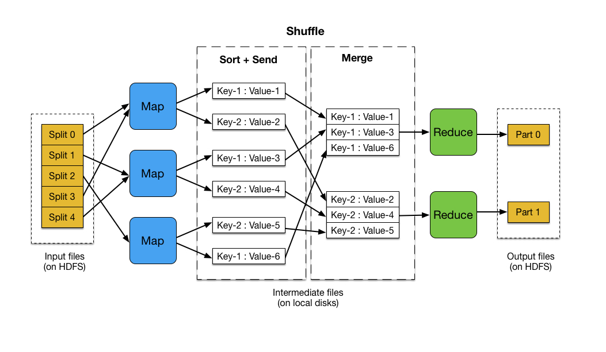

---
---

# MapReduce Basics

::: tip

- Be able to write basic MapReduce programs.

:::

In the [previous](/hadoop/hdfs-basic.html) section we put the input data into a Hadoop Distributed File System (HDFS).
Now, let's learn how to write a distributed computing program using the *Hadoop MapReduce* paradigm.

## MapReduce

MapReduce works by breaking the processing into two phases: map and reduce.
Each phase uses key-value pairs as input and output, the types of which can be chosen by the user. An overview of the MapReduce paradigm is shown below.



The input files are split and fed to mappers on different machines. Each mapper processes the corresponding input file "splits" line by line, and outputs the resulting key-value pairs to the local disk. Hadoop then performs a shuffle operation wherein the key-value data output by the map operations is sorted across machines. This is done to collect the key value data and group it by key so that data with the same key is sent to the same reducer. The reducers then combines each group of key-value pairs with the same key into a single key-value pair. Since the shuffle phase is carried out automatically by Hadoop, the user only needs to define the `map` and `reduce` operations.

Let's write a simple MapReduce program in Java to calculate the frequency of each `event-id` in our **case.csv** file (described in [sample data](/data.html)).

A MapReduce program consists of three parts:

1. A Mapper
2. A Reducer
3. A main function that tells Hadoop to use the classes we created.

### Mapper

Create a Java file `FrequencyMapper.java`. The FrequencyMapper class extends the predefined `Mapper` class and overwrites the `map` function.

```java
import java.io.IOException;

import org.apache.hadoop.io.IntWritable;
import org.apache.hadoop.io.LongWritable;
import org.apache.hadoop.io.Text;
import org.apache.hadoop.mapreduce.Mapper;

public class FrequencyMapper
  extends Mapper<LongWritable, Text, Text, IntWritable> {

  private final static IntWritable one = new IntWritable(1);

  @Override
  public void map(LongWritable offset, Text lineText, Context context)
      throws IOException, InterruptedException {

    String line = lineText.toString();
    String eventID = line.split(",")[1];
    context.write(new Text(eventID), one);
  }
}
```

The map function is illustrated below.


The 4-tuple `<LongWritable, Text, Text, IntWritable>` specifies that the input key-value pair is of type `<LongWritable, Text>` and the output key-value type is of type `<Text, IntWritable>`.
Since the input files are plain text, we use the input key-value pair of type `<LongWritable, Text>`. The key is the offset of the start of each line, which is not used here. The value is the actual text in the corresponding line.

We use `toString()` to transform the Hadoop `Text` object into the more familiar Java `String` object and extract only the second field of the line (recall that each line is in the form of `patient-id, event-id, timestamp, value`). We then call `context.write` to write the output. Each `line` will be mapped to a pair structured as `(event-id, 1)`, where 1 is of type IntWritable. Since 1 is a constant, we use a static variable to store it. 

### Reducer

Hadoop internally performs a shuffling process to ensure that the output of the mapper with the same key (same `event-id` in our case) will go to the same reducer. A reducer thus receives a key and a collection of corresponding values (Java `Iterable` object). In our case the key-value pair is `(event-id, [1,1,...,1])`.
This can be illustrated with the following example.


Create a Java file `FrequencyReducer.java`. The FrequencyReducer class extends the predefined `Reducer` class and overwrites the `reduce` function.

```java
import java.io.IOException;

import org.apache.hadoop.io.IntWritable;
import org.apache.hadoop.io.Text;
import org.apache.hadoop.mapreduce.Reducer;

public class FrequencyReducer extends Reducer<Text ,  IntWritable ,  Text ,  IntWritable > {
     @Override public void reduce( Text eventID,  Iterable<IntWritable> counts,  Context context)
         throws IOException,  InterruptedException {

      int sum  = 0;
      for ( IntWritable count  : counts) {
        sum  += count.get();
      }
      context.write(eventID,  new IntWritable(sum));
    }
}

```

The 4-tuple `<Text, IntWritable, Text, IntWritable >` specifies the types of the input and output key-value pair.
Note that the type of the input key-value pair (`<Text, IntWritable>`) is the same as the output key-value pair of the mapper.

### Main function

Write a Java file `Frequency.java` that runs the MapReduce job.

```java
import org.apache.hadoop.fs.Path;
import org.apache.hadoop.io.IntWritable;
import org.apache.hadoop.io.Text;
import org.apache.hadoop.mapreduce.Job;
import org.apache.hadoop.mapreduce.lib.input.FileInputFormat;
import org.apache.hadoop.mapreduce.lib.output.FileOutputFormat;

public class Frequency {

  public static void main(String[] args) throws Exception {
    if (args.length != 2) {
      System.err.println("Usage: Frequency <input path> <output path>");
      System.exit(-1);
    }

    // create a Hadoop job and set the main class
    Job job = Job.getInstance();
    job.setJarByClass(Frequency.class);
    job.setJobName("Frequency");

    // set the input and output path
    FileInputFormat.addInputPath(job, new Path(args[0]));
    FileOutputFormat.setOutputPath(job, new Path(args[1]));

    // set the Mapper and Reducer class
    job.setMapperClass(FrequencyMapper.class);
    job.setReducerClass(FrequencyReducer.class);

    // specify the type of the output
    job.setOutputKeyClass(Text.class);
    job.setOutputValueClass(IntWritable.class);

    // run the job
    System.exit(job.waitForCompletion(true) ? 0 : 1);
  }
}
```

### Compile and Run

You will find all of the source code in the `sample/hadoop` folder. You will need to navigate to that folder first, compile, and create the jar before running it.

#### Compile

Compile the three java files with `javac`:

```bash
> mkdir classes
> javac -cp $(hadoop classpath) -d classes FrequencyMapper.java FrequencyReducer.java Frequency.java 
```

where `hadoop classpath` outputs the required class path to compile a Hadoop program. `-d classes` puts the generated classes into the `classes` directory. After running this command you will see three class files in the `classes` directory.

#### Create JAR

Let's create a jar named `Frequency.jar` using classes we just compiled.

```bash
jar -cvf Frequency.jar -C classes/ .
```

::: tip
In a real-world application development, you will not need to compile files manually one by one and then create the jar. Build tools like Maven, Gradle, SBT can be used to handle this process instead.
:::

#### Run

You can run the jar file just created with the command:

```bash
hadoop jar Frequency.jar Frequency input/case.csv output
```

where `Frequency.jar` is the name of the jar file we just created and `Frequency` is the Java class to run. `input` and `output` are parameters to the `Frequency` class we implemented. Please note that `input/case.csv` and `output` are both paths in HDFS (and not the local file system). We specify the file `input/case.csv` as input, but we could only specify `input` as the input parameter if we want to process all files in the input folder in HDFS (in this case both `input/case.csv` and `input/control.csv`). Note that in that case you wouldn't need to create `output` folder yourself as the Hadoop framework would do that for you.

::: tip
In the log output you may see messages like 'uber mode'. This means that the mappers and reducers will be forced to run under the same YARN container.
:::

While the program is running, you will see a lot of messages. After the job finishes, you can check the results in the `output` directory (created by Hadoop) by using the commands:

```bash
hdfs dfs -ls output
hdfs dfs -cat output/*
```

You will get results like:

```
DIAG03812       2
DIAG03819       1
DIAG0420        1
DIAG0539        2
DIAG05443       1
DIAG06640       1
DIAG07032       1
DIAG1120        5
...
```

Please note that the output content order may be different from above.
If the output files are not too large, you can copy and merge all of them into a local file by using the command:

```bash
> hdfs dfs -getmerge output local_output.txt
```

#### Clean up

If you run the job again, you will see an error message saying the `output` directory already exists. This prevents a user from accidentally overwriting a file. You can remove the directory by using the command:

```bash
hdfs dfs -rm -r output
```

<ExerciseComponent
    question="Count diagnostic code only (events that start with DIAG)."
    answer="">

You can achieve this by updating mapper as

```java
public void map(LongWritable offset, Text lineText, Context context)
    throws IOException, InterruptedException {

  String line = lineText.toString();
  String eventID = line.split(",")[1];
  if(eventID.startsWith("DIAG")){
    context.write(new Text(eventID), one);
  }
}
```

</ExerciseComponent>

<ExerciseComponent
    question="Find the maximum payment of each patient"
    answer="">

##### Mapper

```java
import java.io.IOException;

import org.apache.hadoop.io.FloatWritable;
import org.apache.hadoop.io.LongWritable;
import org.apache.hadoop.io.Text;
import org.apache.hadoop.mapreduce.Mapper;

public class MaxPaymentMapper
  extends Mapper<LongWritable, Text, Text, FloatWritable> {

  @Override
  public void map(LongWritable offset, Text lineText, Context context)
      throws IOException, InterruptedException {

    String line = lineText.toString();
    if(line.contains("PAYMENT")) {
        String patientID = line.split(",")[0];
        float payment = Float.parseFloat(line.split(",")[3]);
        context.write(new Text(patientID), new FloatWritable(payment));
    }
  }
}
```

##### Reducer

```java
import java.io.IOException;

import org.apache.hadoop.io.FloatWritable;
import org.apache.hadoop.io.Text;
import org.apache.hadoop.mapreduce.Reducer;

public class MaxPaymentReducer extends Reducer<Text ,  FloatWritable ,  Text ,  FloatWritable > {
     @Override public void reduce( Text patientID,  Iterable<FloatWritable> payments,  Context context)
         throws IOException,  InterruptedException {

      float maxPayment  = 0.0f;
      for ( FloatWritable payment : payments) {
        float p = payment.get();
        if(p > maxPayment)
          maxPayment = p;
      }
      context.write(patientID,  new FloatWritable(maxPayment));
    }
}

```

##### Main function

```java
import org.apache.hadoop.fs.Path;
import org.apache.hadoop.io.FloatWritable;
import org.apache.hadoop.io.Text;
import org.apache.hadoop.mapreduce.Job;
import org.apache.hadoop.mapreduce.lib.input.FileInputFormat;
import org.apache.hadoop.mapreduce.lib.output.FileOutputFormat;

public class MaxPayment {

  public static void main(String[] args) throws Exception {
    if (args.length != 2) {
      System.err.println("Usage: MaxPayment <input path> <output path>");
      System.exit(-1);
    }

    // create a Hadoop job and set the main class
    Job job = Job.getInstance();
    job.setJarByClass(MaxPayment.class);
    job.setJobName("MaxPayment");

    // set the input and output path
    FileInputFormat.addInputPath(job, new Path(args[0]));
    FileOutputFormat.setOutputPath(job, new Path(args[1]));

    // set the Mapper and Reducer class
    job.setMapperClass(MaxPaymentMapper.class);
    job.setReducerClass(MaxPaymentReducer.class);

    // specify the type of the output
    job.setOutputKeyClass(Text.class);
    job.setOutputValueClass(FloatWritable.class);

    // run the job
    System.exit(job.waitForCompletion(true) ? 0 : 1);
  }
}

```

##### Compile and run

```bash
> rm classes/*
> javac -cp $(hadoop classpath) -d classes MaxPayment.java MaxPaymentMapper.java MaxPaymentReducer.java
> jar -cvf MaxPayment.jar -C classes/ .
> hadoop jar MaxPayment.jar MaxPayment input output
```

</ExerciseComponent>
