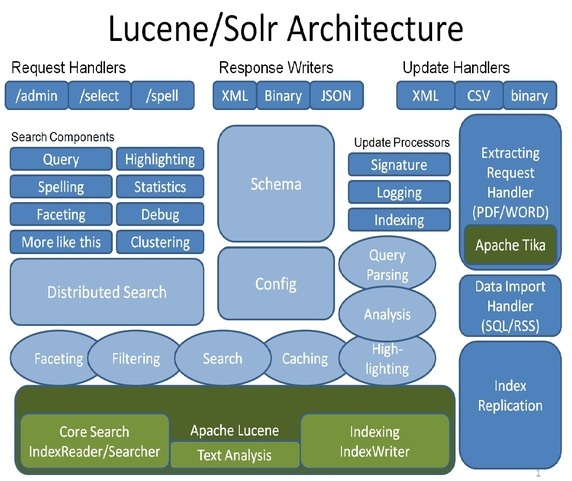
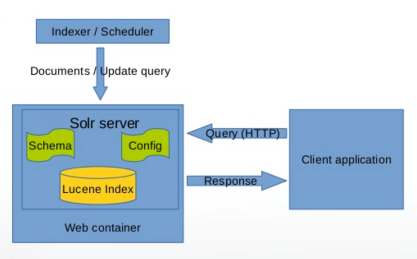
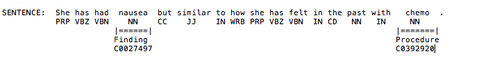
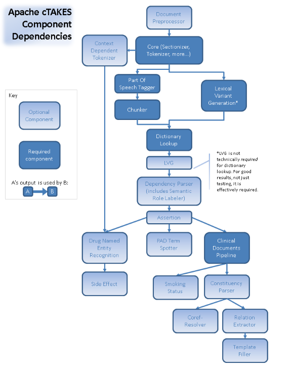

# Solr

::: tip Learning Objectives

- To understand the basics of Clinical NLP with Solr and cTAKES

:::

[[toc]]

[Solr](http://lucene.apache.org/solr/) is one of the most common search platforms, built on the powerful indexing platform [Lucene](https://lucene.apache.org/). The main feature of Solr is high-speed, scalable text search. It's most thought of as Google-like search (e.g. find me all the documents that mention 'cancer'). In addition, it supports highlighting, faceted search, spelling and fuzziness approximation, and 'more like this' searches. It supports many common data types like CSV, XML, text, Microsoft Word and PDF.


Both Solr and Lucene are written in Java, but provide Rest-like HTTP interfaces and also native support in JVM languages, Python, Ruby, PHP, C++, and [others](https://cwiki.apache.org/confluence/display/solr/Client+APIs).

Solr can be scaled to large clusters to using Zookeeper, but this discussion is focused on the basic features of Solr using a single instance.

## Getting Started

To run Solr, you'll need at least to be running Java 8. After that, download and decompress the tar file.

### Downloading Solr

```bash
wget http://www-eu.apache.org/dist/lucene/solr/7.3.1/solr-7.3.1.tgz
tar -xvf solr-7.3.1.tgz
```
In case of the above link is broken, you can also use this url instead: <http://sunlab.org/teaching/download/nlp/solr/solr-7.3.1.tgz>.

### Starting up Solr

Navigating to the directory where Solr is decompressed, execute the following command.

```bash
bin/solr start
```

By default Solr runs on 8983. Verify Solr is running by visiting [the Solr Dashboard](http://localhost:8983/) in your browser.

```
http://localhost:8983/solr/#/
```

### A Few More Starting Details

As mentioned above, Solr can run as single instance or as a cluster. It can be ran alongside Hadoop and is often distributed with major Hadoop installations. Solr can be used to store documents, or just used for indexing, referencing documents in another data store such as HBase or Cassandra.

The Solr Dashboard provides some metrics about your installation, logging, configuration, and administration of cores. Most Solr installations will have a custom client application built on top of Solr, with a typical (simplified) installation looking something like this.



## Setting up a Core

Part of Solr's power is being able to pass it a block of text, and its ability to quickly find a specific word mentioned in that text. For that reason, it supports very flexible schemas and [data types](https://cwiki.apache.org/confluence/display/solr/Field+Types+Included+with+Solr), with very few constraints. Those constraints are, each document much have a unique identifier, and each schema must have a default search field.

In additional to static fields, Solr supports dynamic fields that can be defined at index time. This allows for future-proofing data sets as new features are added.

To get going with Solr, we need to setup a Solr core. Think of a core like any data store, with one schema, storing a set of documents. A Solr installation can have multiple cores, if needed.

From the Solr home, execute the following command.

```bash
bin/solr create -c reports
```

This will setup the basic config and location of our documents, but we still need to define our schema.

### Adding Custom Field Types

Although Solr provides many fields, we may want to add custom fields to tell Solr how to tokenize and store text data. In this case, we split on white space, so we can search for individual tokens easily.

Run the following:

```bash
curl -X POST -H 'Content-type:application/json' --data-binary '{
  "add-field-type" : {
     "name":"searchText",
     "class":"solr.TextField",
     "positionIncrementGap":"100",
     "analyzer" : {
        "charFilters":[{
           "class":"solr.PatternReplaceCharFilterFactory",
           "replacement":"$1$1",
           "pattern":"([a-zA-Z])\\\\1+" }],
        "tokenizer":{
           "class":"solr.WhitespaceTokenizerFactory" },
        "filters":[{
           "class":"solr.WordDelimiterFilterFactory",
           "preserveOriginal":"0" }]}}
}' http://localhost:8983/solr/reports/schema
```

### Adding Fields

Run the following commands to add fields to our new core.

```bash
curl -X POST -H 'Content-type:application/json' --data-binary '{
  "add-field":{"name":"report_date","type":"pdate","indexed":true,"stored":true},
"add-field":{"name":"report_id","type":"string","indexed":true,"stored":true},
"add-field":{"name":"report_text","type":"searchText","indexed":true,"stored":true,"termPositions":true,"termVectors":true,"docValues":false,"required":true},
"add-field":{"name":"warnings_section","type":"searchText","indexed":true,"stored":true,"termPositions":true,"termVectors":true,"docValues":false,"required":true},
"add-field":{"name":"contraindications_section","type":"searchText","indexed":true,"stored":true,"termPositions":true,"termVectors":true,"docValues":false,"required":true},
"add-field":{"name":"indications_and_usage_section","type":"searchText","indexed":true,"stored":true,"termPositions":true,"termVectors":true,"docValues":false,"required":true},
"add-field":{"name":"precautions_section","type":"searchText","indexed":true,"stored":true,"termPositions":true,"termVectors":true,"docValues":false,"required":true},
"add-field":{"name":"ingred_attrs","type":"searchText","indexed":true,"stored":true,"termPositions":true,"termVectors":true,"docValues":false,"required":true},
"add-field":{"name":"source","type":"string","indexed":true,"stored":true},
"add-field":{"name":"organization_attr","type":"string","indexed":true,"stored":true},
"add-field":{"name":"subject","type":"string","indexed":true,"stored":true},"add-field":{"name":"report_type","type":"string","indexed":true,"stored":true}
}' http://localhost:8983/solr/reports/schema
```

We have some basic metadata fields for id, type, and our default search field is `report_text`.

## Indexing

Indexing is the way to get documents into Solr. Solr provides some native POST tools to load documents in Solr, for JSON, XML and CSV. Many of the native language Solr libraries also support indexing such as SolrJ. For this example, will run the following command to index a subset of the [FDA Drug Label](https://dailymed.nlm.nih.gov/dailymed/spl-resources-all-drug-labels.cfm) set into Solr.

There is a copy of the dataset in our repository in `bootcamp/solr`. You should uncompress it first using command:

```bash
tar -xJvf solr_data.tar.xz
```

```bash
bin/post -c reports /path/to/bigdata-bootcamp/data/drug_labels.csv
```

See more information about indexing [here](https://cwiki.apache.org/confluence/display/solr/Indexing+and+Basic+Data+Operations).

## Searching

Searching is the most common feature of Solr. Solr can be searched via REST, CURL, wget, etc. The Solr admin interface is the easiest way to begin searching.

[http://localhost:8983/solr/#/reports/query](http://localhost:8983/solr/#/reports/query)

The default query syntax is `field:query`, therefore `*:*` returns all documents. If you don't specify a field, Solr will search all fields. You can query using the admin tool, or using something like curl, e.g.

```bash
curl "http://localhost:8983/solr/reports/select?indent=on&q=*:*&wt=json"
```

Solr supports different query parsers, but the default parser can support things like:

- Single Token or word searches
  - `curl "http://localhost:8983/solr/reports/select?indent=on&q=vomiting&wt=json"` (any mention of 'vomiting')
- Phrase queries
  - `curl "http://localhost:8983/solr/reports/select?indent=on&q=%22birth%20defects%22&wt=json"` (any mention of the phrase "birth defects")
- Boolean queries
  - `curl "http://localhost:8983/solr/reports/select?indent=on&q=seizure%20NOT%20uncontrolled&wt=json"` (mentions of 'seizure' as long as 'uncontrolled' is not present)
  - `curl "http://localhost:8983/solr/reports/select?indent=on&q=seizure%20AND%20(%22without%20epilepsy%22%20OR%20%22no%20epilepsy%22%20OR%20%22not%20having%20epilepsy%22)&wt=json"` (any mention of seizure, where at least one of the following phrases in present "without epilepsy", "no epilepsy", "not having epilepsy")
- Word Distance
  - `curl "http://localhost:8983/solr/reports/select?indent=on&q=%22mood%20changes%22~3&wt=json"` (The word "mood" within 3 words of "changes")
- Spelling Variations (very useful in clinical text where words are often misspelled, not as useful on this data set)
  - `curl "http://localhost:8983/solr/reports/select?indent=on&q=valproate~0.8&wt=json"` (all spelling variations of "valproate" with a threshold of 0.8, scale is 0-1)
- Range queries (on numeric and date fields), e.g.
  - timestamp:[* TO NOW]
  - count:[* TO 100]

By default, a query will return the first 10 rows, but you can tweak that, using the `rows` (how many to return) and `start` (how far to offset the results - default 0).

All documents will return by default, in score order, basically how relevant a document is to the query. Lucene uses a Vector Space Model and a Boolean Model to determine how similar the document is to the query.

The `wt` field is the format the data will return, the default is JSON, however you can use any of the following:

- json
- xml
- Python
- Ruby
- PHP
- csv

If you just want to see a limited number of fields, you can use the `fl` parameter to limit the field set.

### Filter query (fq)

You can use the same fields in the filter query as the default query, however filter queries don't use scoring, so they may be faster and more useful in limiting result sets. Filter queries can be similar to a `WHERE` clause predicates in SQL.

## Additional Features

Solr supports many other IR and text tools other than search. They include faceting, highlighting, term vectors and term frequency, spelling suggestions, and more like this, etc. We'll cover a couple of these in depth. See a full list of all the Solr components [here](https://cwiki.apache.org/confluence/display/solr/Searching).

### Faceting

Faceting is popular aspect of Solr searching to bucket or categorize your Solr data. It's basically way to see how many unique documents match the query, by category. For example, in our data set, it's useful to see all the unique drugs and how many of each there are.

We can run the following:

```bash
curl 'http://localhost:8983/solr/reports/select?wt=json&indent=true&q=*:*&rows=0''&facet=true&facet.field=subject'
```

We can also facet with ranges (in numeric and date fields), or use [facet pivots](https://lucidworks.com/2014/10/03/pivot-facets-inside-and-out/) for a decision tree like result.

```json
{
  "field": "subject",
  "value": "topiramate",
  "count": 31,
  "pivot": [
    {
      "field": "organization_attr",
      "value": "REMEDYREPACK INC.",
      "count": 4
    },
    {
      "field": "organization_attr",
      "value": "Unit Dose Services",
      "count": 4
    },
    {
      "field": "organization_attr",
      "value": "Bryant Ranch Prepack",
      "count": 3
    },
    {
      "field": "organization_attr",
      "value": "PD-Rx Pharmaceuticals, Inc.",
      "count": 3
    },
    {
      "field": "organization_attr",
      "value": "DIRECT RX",
      "count": 2
    }
  ]
},
{
  "field": "subject",
  "value": "divalproex sodium",
  "count": 7,
  "pivot": [
    {
      "field": "organization_attr",
      "value": "State of Florida DOH Central Pharmacy",
      "count": 3
    },
    {
      "field": "organization_attr",
      "value": "REMEDYREPACK INC.",
      "count": 2
    }
  ]
}
```

### Terms and Term Vectors

The Terms component is useful to see the most common tokens in your schema, and you can limit to a specific field or range of terms. It can be useful for making suggestions to users, but it may also benefit from data cleaning, such as stop word removal, e.g.

```
http://localhost:8983/solr/reports/terms?terms.fl=report_text&terms.limit=100
```

The Term Vector component can be enabled on a field by setting `termVectors=true`. It can return the term frequency, inverse document frequency, position and offset information. Term frequency-inverse document frequency or <b>tf-idf</b> is a common statistic used in IR, basically weighting the term to how many times it appears in a particular documents, versus the frequency of the term in the entire document set. It helps identify the importance of terms, and offsets common words like 'the', 'at', 'her', etc.

```
http://localhost:8983/solr/reports/tvrh?q=*%3A*&start=0&rows=1&fl=id,warnings_section&tv.tf_idf=true
```

### [Highlighting](https://cwiki.apache.org/confluence/display/solr/Highlighting)

Highlights the document fragments that match the query

Sample:

```
http://localhost:8983/solr/reports/select?hl=on&q=seizure&wt=xml&hl.fl=report_text&fl=subject
```

### [Spelling](https://cwiki.apache.org/confluence/display/solr/Spell+Checking)

Recommends spelling suggestions based on the Solr index

Sample:

```
http://localhost:8983/solr/reports/spell?df=text&spellcheck.q=siezure&spellcheck=true&spellcheck.collateParam.q.op=AND&wt=xml
```

### [MoreLikeThis](https://cwiki.apache.org/confluence/display/solr/MoreLikeThis)

Queries for similar documents to the search results.

Sample:

```
http://localhost:8983/solr/reports/select?indent=on&q=%22treatment%20of%20partial%20seizures%22&wt=json&fl=indications_and_usage_section&rows=10&mlt=true&mlt.fl=indications_and_usage_section
```

## SolrJ

[SolrJ](https://cwiki.apache.org/confluence/display/solr/Using+SolrJ) is Java API that simplifies some of the interactions with Solr, abstracting it to higher level methods. You can index with SolrJ as well. Here's a simple example in Scala.

```js
val url = "http://localhost:8983/solr/reports"
val solr = new HttpSolrClient.Builder(url).build();

val query = new SolrQuery();
query.setQuery("report_text:aspirin");

val response = solr.query(query);

val iterator = response.getResults().iterator()
while (iterator.hasNext()) {
  val doc = iterator.next()
  val text = doc.getFieldValue("report_text").toString()
  println(text)
}

```

## Deeper Clinical NLP - cTAKES

So far, Solr is proven to be a very powerful tool for search and  information retrieval. However to do real data discovery, we may need to apply other NLP techniques, such as named entity recognition (NER), or tagging text as different semantic classes. Cases in which we need this kind of deeper analysis, include:

- <b>Negation</b> (e.g. 'The patient has a history of lung cancer, but denies smoking, asthma, etoh')
- <b>Section Metadata</b> (e.g. only extract mentions of 'cancer' in the 'Family History' section)
- <b>Syntactical Variations</b> (e.g. 'sinus polyp' vs. 'polyp in the left maxillary sinus')
- <b>Relationship Discovery and Co-Reference</b> (e.g. 'The patient is taking benadryl for her sleep issues.')
- <b>Morphologic normalization and stemming</b> (e.g. take, taking, takes)
- <b>Synonyms and Abbreviation normalization</b> (e.g. Melanoma and skin cancer; 'CC' for Chief Complaint, or 'cc' for cubic centimeters, or 'CC' for Carbon Copy)
- <b>Temporal and Hypothetical resolution</b> (e.g. 'The patient was seen for a breast lump last year.', or 'If you are still experiencing nausea, take 1 tablet of OTC Dramamine')

[cTAKES](http://ctakes.apache.org/) is an open source modular tool built out of Mayo, using Java. It's built on an Apache UIMA (Unstructured Information Management Architecture). Core cTakes components include:

- Sentence boundary parsing ([OpenNLP](https://opennlp.apache.org/))
- Tokenization
- Morphologic normalization (using [LVG](https://www.nlm.nih.gov/research/umls/new_users/online_learning/LEX_004.html))
- Part of Speech Tagging (OpenNLP)
- Shallow Parsing, or Chunker (OpenNLP)
- NER ([UMLS](https://www.nlm.nih.gov/research/umls/) Dictionary Lookup)
  - Disorders, Findings, Anatomical Sites, Procedures, Medications
- Negation and Context ([NegEx](http://blulab.chpc.utah.edu/content/contextnegex))



### Getting Started with cTAKES

- [Download or checkout from SVN](http://ctakes.apache.org/downloads.cgi)
- Sign up for a UMLS account (These will be JVM args)
- You can use the GUI Visual Debugger tool, see [here](https://cwiki.apache.org/confluence/display/CTAKES/cTAKES+3.2+User+Install+Guide)
- Or checkout cTAKES from source, see [here](https://cwiki.apache.org/confluence/display/CTAKES/cTAKES+3.2+Developer+Install+Guide)
- Or run cTAKES as a dependency or your project, see a sample project [here](https://github.com/healthnlp/examples)
- Determine what components you need for your project, and setup an Aggregator, or use the pre-built ones



- Or write your own cTAKES annotator

### Other NLP libraries

Of course many of these tasks can be done with other NLP libraries like NLTK or spaCy. These are probably faster to get started, however, they don't ship with pre-built clinical models like cTAKES.

## Cleanup

### Clearing out documents

Only do this with CAUTION. Solr will delete all the documents matching your query.

```
http://localhost:8983/solr/reports/update?stream.body=%3Cdelete%3E%3Cquery%3Ereport_text%3A%22query%20of%20documents%20to%20delete%22%3C%2Fquery%3E%3C%2Fdelete%3E&commit=true
```

You can also delete with a post command.

```bash
bin/post -c reports -d "<delete><id>eb02779c-acdc-48ed-9d23-ca39ba152d0d</id></delete>"
```

### Stopping Solr

You can stop Solr by running:

```bash
bin/solr stop
```

<ExerciseComponent
    question="Faceting to dig deeper"
    answer="">

Use facet queries to find the most common manufacturer (organization_attr).

```
http://localhost:8983/solr/reports/select?facet.field=organization_attr&facet=on&indent=on&q=*:*&rows=0&wt=json
```

What are the most common drugs (subject) by this manufacturer? Look at using a filter query (fq) for limiting your search. Filter queries can improve speed and simplify your principal query (q).

```
http://localhost:8983/solr/reports/select?facet.field=subject&facet=on&indent=on&q*:*&fq=organization_attr:%22REMEDYREPACK%20INC.%22&rows=0&wt=json
```

Facet pivots provide a decision-tree like result to return multiple facets. How do you use facets to find the most common drugs and manufacturers?

```
http://localhost:8983/solr/reports/select?q=*:*&facet.pivot=subject,organization_attr&facet=true&facet.field=subject&facet.limit=5&rows=0&wt=json&indent=true&facet.pivot.mincount=2
```

</ExerciseComponent>

<ExerciseComponent
    question="Finding common terms"
    answer="">

Look at the terms handler in Solr. How do you return the top 250 terms in the warnings_section?

```
http://localhost:8983/solr/reports/terms?terms.fl=warnings_section&terms.limit=250
```

What common NLP techniques might be used to reduce this number to a more meaningful list?

- Standardization of case
- Stop word removal
- Remove of single characters
- Stemming

</ExerciseComponent>

<ExerciseComponent
    question="Create a new document collection"
    answer="">

Create a new document core using `drug_labels.json`. What dynamic fields can be added an extracted out?

- `*_section`
- `*_attr`
- `*_attrs`

How do we add dynamic fields to our schema?

```bash
curl -X POST -H 'Content-type:application/json' --data-binary '{
 "add-dynamic-field":{"name":"*_section","type":"searchText","indexed":true,"stored":false},
"add-dynamic-field":{"name":"*_attr","type":"string","indexed":true,"stored":true},
"add-dynamic-field":{"name":"*_attrs","type":"string","multiValued":true,"indexed":true,"stored":true}
}' http://localhost:8983/solr/report_core/schema
```

What is the command to use the POST tool with JSON?

```bash
bin/post -c reports yourfile.json
```

EXTRA: Index data from the original source [documents](https://dailymed.nlm.nih.gov/dailymed/spl-resources-all-drug-labels.cfm). Write a script to map the original fields to your Solr fields. (See sample source document `levetiracetam.xml`, what additional fields would you want to capture in your index?)

</ExerciseComponent>
