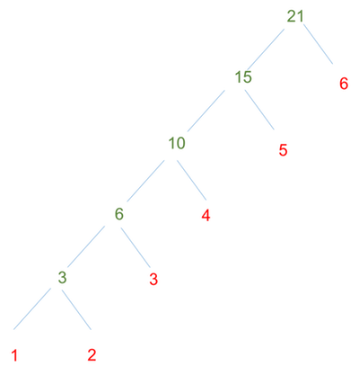

---
---
# Scala Basics

::: tip Learning Objectives

- Learn how to work with Scala interactive shell.
- Understand `var` and `val`.
- Define variables, functions and classes, and make function calls
- Understand Simple Build Tool (SBT).

:::

In this section we will briefly go through the essential knowledge about Scala. You will first learn how to work with Scala shell, then learn how to use variables, functions with examples. Finally, we give instructions about how to compile and run a standalone program using `sbt`.

## Scala Shell

You can open a Scala shell by typing `scala`. Or, you can use [sbt](http://www.scala-sbt.org/index.html) by typing `sbt console`. The second approach will help you add your project source code and dependencies into class path, so that your functions or library functions will be available for you to try to in the interactive shell. But in this training, we will stick to Scala shell for simplicity.

Once starting the Scala shell you will see

```scala
$ scala
Welcome to Scala version 2.10.5 (Java HotSpot(TM) 64-Bit Server VM, Java 1.8.0).
Type in expressions to have them evaluated.
Type :help for more information.

scala>
```

You can type `:quit` to stop and quit the shell, but don't do that now :-) Next you will learn some Scala operations in the shell with the following materials.

## Variables

### Declare `val` and `var`

In Scala, there are two types of variable, immutable `val` and mutable `var`. Unlike some functional programming language that requires immutable variables, Scala allows existence of mutable variables but immutable is recommended as it is easier to verify the correctness of your program. Suppose you are still in the Scala interactive shell. Define an immutable variable as

```scala
scala> val myInt = 1 + 1
myInt: Int = 2

scala> myInt = 3
```

where `val` is a keyword in `scala` that makes the variables immutable. If you reassign a value to `myInt`, error will be reported.

```scala
scala> myInt = 3
<console>:8: error: reassignment to val
       myInt = 3
             ^
scala>
```

::: warning

In interactive shell, it's possible to redefine variable with same name. In Scala source code file, it's not allowed.

```scala
scala> val a = 1
a: Int = 1

scala> val a = 2
a: Int = 2
```

:::

Instead, variables declared with `var` are mutable. Ideally, we try to use `val` instead of `var` if possible as a good practice of functional programming. 

::: tip
You may have concern that maybe too many immutable variables will be declared. Actually, with chained function calls, that situation is not the case for well organized code.
:::

An example of mutable variable is

```scala
scala> var myString = "Hello Big Data"
myString: String = Hello Big Data

scala> myString = "Hello Healthcare"
myString: String = Hello Healthcare
```

### Type

Scala may seem like a script language like JavaScript or Python, as variable type is not specified explicitly. In fact, Scala is a static type language and the compiler can implicitly infer the type in most cases. However, you can always specify a type as

```scala
scala> val myDouble: Double = 3
myDouble: Double = 3.0
```

It is always encouraged to specify the type so unless the type is too obvious.

Besides simple built-in variable types like `Int`, `Double` and `String`, you will also learn about `List` and `Tuple` in the training: 

```scala
scala> val myList: List[String] = List("this", "is", "a", "list", "of", "string")
myList: List[String] = List(this, is, a, list, of, string)

scala> val myTuple: (Double, Double) = (1.0, 2.0)
myTuple: (Double, Double) = (1.0,2.0)
```

Here the `List[String]` is syntax of generics in Scala, which is same as `C#`. In the above example, `List[String]` means a `List` of `String`. Similarly, `(Double, Double)` means a two-field tuple type and both the 1st element and the 2nd element should be of type `Double`.

## Functions

You can define a function and invoke the function like

```scala
scala> def triple(x: Int): Int = {
          x*3
       }
triple: (x: Int)Int

scala> triple(2)
res0: Int = 6
```

Where `x: Int` is parameter and its type, and the second `Int` is function return type. There's not explicit `return` statement, but the result of last expresssion `x*3` will be returned (similar to some other programming languages like `Ruby`). In this example, as there is only one expression and return type can be infered by the compiler, you may define the function as

```scala
def triple(x: Int) = x*3
```

Scala is object-oriented (OO), function calls on a class method are straightforward like most OO languages (e.g. Java, C#)

```scala
scala> myString = "Hello Healthcare"
myString: String = Hello Healthcare
scala> myString.lastIndexOf("Healthcare")
res1: Int = 6
```

If the function does not have parameters, you can even call it without parenthesis

```scala
scala> val myInt = 2
scala> myInt.toString
res2: String = 2
```

You can also define an anonymous function and pass it to variable like a lambda expression in some other languages such as Python:

```scala
scala> val increaseOne = (x: Int) => x + 1
increaseOne: Int => Int = <function1>

scala> increaseOne(3)
res3: Int = 4
```

Anonymous function is very useful as it can be passed as a parameter to a function call

```scala
scala> myList.foreach{item: String => println(item)}
this
is
a
list
of
string
```

where `item: String => println(item)` is an anonymous function. This function call can be further simplified to

```scala
scala> myList.foreach(println(_))
scala> myList.foreach(println)
```

where `_` represents first parameter of the anonymous function with body `println(_)`. Additional `_` can be specified to represent more than one parameter. For example, we can calculate the total payment that a patient made by

```scala
scala> val payments = List(1, 2, 3, 4, 5, 6)
payments: List[Int] = List(1, 2, 3, 4, 5, 6)

scala> payments.reduce(_ + _)
res0: Int = 21
```

In above example, `reduce` will aggregate `List[V]` into `V` and we defined the aggregator as `_ + _` to sum them up. Of course, you can write that more explicitly like

```scala
scala> payments.reduce((a, b) => a+b)
res1: Int = 21
```

Here `reduce` is a construct from functional programming. It can be illustrated with the figure below where a function _f_ is applied to one element at a time and the result together with next element will be parameters of the next function call until the end of the list.



It's important to remember that for `reduce` operation, the input is `List[V]` and the output is `V`. Interested reader can learn more from [wiki](https://en.wikipedia.org/wiki/Fold_\(higher-order_function\)). In contrast to `reduce`, you can of course write code using `for` loop, which is verbose and very rare in Scala,

```scala
scala> var totalPayment = 0
totalPayment: Int = 0

scala> for (payment <- payments) {
         totalPayment += payment
       }

scala> totalPayment
res2: Int = 21

scala>
```

## Class

Declaration of a class in Scala is as simple as

```scala
scala> class Patient(val name: String, val id: Int)
defined class Patient

scala> val patient = new Patient("Bob", 1)
patient: Patient = Patient@755f5e80

scala> patient.name
res13: String = Bob
```

Here we see the succinct syntax of Scala again. `class Patient(val name: String, val id: Int)` not only defines constructor of `Patient` but also defines two member variables (`name` and `id`).

A special kind of class that we will use a lot is [`Case Class`](http://www.scala-lang.org/old/node/107). `Case Class` can be declared as

```scala
scala> case class Patient(val name: String, val id: Int)
```

and see below [Pattern Matching](#pattern-matching) for use case.

## Pattern Matching

You may know the `switch..case` in other languages. Scala provides a more flexible and powerful technique, `Pattern Matching`. Below example shows one can match by-value and by-type in one match.

```scala
val payment:Any = 21
payment match {
    case p: String => println("payment is a String")
    case p: Int if p > 30 => println("payment > 30")
    case p: Int if p == 0 => println("zero payment")
    case _ => println("otherwise")
}
```

It's very convenient to use case class in pattern matching

```scala
scala> val p = new Patient("Abc", 1)
p: Patient = Patient(Abc,1)

scala> p match {case Patient("Abc", id) => println(s"matching id is $id")}
matching id is 1
```

Here we not only matched `p` as `Patient` type, but also matched patient name and extracted one member field from the `Patient` class instance.

<ExerciseComponent
    question="Add default case to above `match` example"
    answer="">

```scala
p match {
    case Patient("Abc", id) => println(s"matching id is $id")
    case _ => println("not matched")
}
```

</ExerciseComponent>

## Standalone Program

Working with large real-world applications, you usually need to compile and package your source code with some tools. Here we show how to compile and run a simple program with [sbt](http://www.scala-sbt.org/index.html). Run the sample code in 'hello-bigdata' folder

```bash
% cd ~/bigdata-bootcamp/sample/hello-bigdata
% sbt run
Attempting to fetch sbt
######################################################################### 100.0%
Launching sbt from sbt-launch-0.13.8.jar
[info] .....
[info] Done updating.
[info] Compiling 1 Scala source to ./hello-bigdata/target/scala-2.10/classes...
[info] Running Hello 
Hello bigdata
[success] Total time: 2 s, completed May 3, 2015 8:42:48 PM
```

The source code file `hello.scala` is compiled and invoked.

## Further Reading

This is a very brief overview of important features from the Scala language. We highly recommend readers to checkout  references below to get a better and more complete understanding of Scala programming language.

- [Twitter Scala School](https://twitter.github.io/scala_school/index.html)
- [Official Scala Tutorial](http://docs.scala-lang.org/tutorials/?_ga=1.128323084.1826222080.1429310377)
- [SBT tutorial](http://www.scala-sbt.org/0.13/tutorial/index.html)
