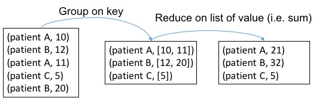

---
---
# Spark Basics

::: tip Learning Objectives

- Invoke command in Spark interactive shell.
- Be familiar with RDD concept.
- Know basic RDD operations.

:::

## Spark Shell

Spark can run in several modes, including YARN client/server, Standalone, Mesos and Local. For this training, we will use local mode. Specifically, you can start the Spark interactive shell by invoking the command below in the terminal to run Spark in the local mode with two threads. Then you will see

```
> spark-shell --master "local[2]" --driver-memory 6G
Using Spark's default log4j profile: org/apache/spark/log4j-defaults.properties
...
[messages]
...
Spark context available as sc.
scala>
```

Here you can set ``--driver-memory`` according to your local setting. If your setting of driver memory is larger than the VM memory, don't forget to change the VM memory setting first.

In Spark, we call the main entrance of a Spark program the **driver** and Spark distribute computation to **worker**s to compute. Here in the interactive shell, the Spark shell program is the driver. In above example we set the memory of driver program to 3GB as in local mode driver and worker are together. A driver program can access Spark through a `SparkContext` object, which represents a connection to a computing cluster. In the above interactive shell, `SparkContext` is already created for you as variable `sc`. You can input `sc` to see its type.

```scala
scala> sc
res0: org.apache.spark.SparkContext = org.apache.spark.SparkContext@27896d3b
```

<NotInUse>

You may find the logging statements that get printed in the shell distracting. You can control the verbosity of the logging. To do this, you can create a file in the conf directory called `log4j.properties`. The Spark developers already include a template for this file called `log4j.properties.template`. To make the logging less verbose, make a copy of `conf/log4j.properties.template` called `conf/log4j.properties` and find the following line:

```
log4j.rootCategory=INFO, console
```

Replace `INFO` with `WARN` so that only WARN messages and above are shown.

</NotInUse>

## RDD

Resilient Distributed Dataset (RDD) is Spark's core abstraction for working with data. An RDD is simply a fault-tolerant **distributed** collection of elements. You can imagine RDD as a large array but you cannot access elements randomly but you can apply the same operations to all elements in the array easily. In Spark, all the work is expressed as either creating new RDDs, transforming existing RDDs, or calling operations on RDDs to compute results. There are two ways to create RDDs: by distributing a collection of objects (e.g., a list or set), or by referencing a dataset in an external storage system, such as a shared filesystem, HDFS, HBase, or any data source offering a Hadoop InputFormat.

### Parallelized Collections

For the demo purpose, the simplest way to create an RDD is to take an existing collection (e.g. a Scala Array) in your program and pass it to SparkContext's `parallelize()` method.

```scala
scala> val data = Array(1, 2, 3, 4, 5)
data: Array[Int] = Array(1, 2, 3, 4, 5)

scala> val distData = sc.parallelize(data)
distData: org.apache.spark.rdd.RDD[Int] = ParallelCollectionRDD[0] at parallelize at <console>:23
```

Once created, the distributed dataset (`distData`) can be operated in parallel. For example, we can add up the elements by calling `distData.reduce((a, b) => a + b)`. You will see more operations on RDD later on.

::: warning

Parallelizing a collection is useful when you are learning Spark. However, this is not encouraged in production since it requires the entire dataset to be in memory of the driver's machine first. Instead, importing data from [external datasets](#external-datasets) should be employed.

:::

### External Datasets

A common way for creating RDDs is loading data from external storage. Below you will learn how to load data from a file system. Assuming you have put some data into HDFS as described in the [HDFS Basic](/hadoop/hdfs-basic.html) section. If not, please do that first.

```scala
scala> val lines = sc.textFile("input/case.csv")
lines: org.apache.spark.rdd.RDD[String] = README.md MapPartitionsRDD[1] at textFile at <console>:21
```

Here in the above example, each line of the original file will become an element in the `lines` RDD.

::: tip
Reading data from a file system, Spark relies on the HDFS library. In above example we assume HDFS is well configured through environmental variables or configuration files so that data is ready in HDFS.
:::

## RDD Operations

RDDs offer two types of operations: **transformations** and **actions**:

- **Transformations** are operations on RDDs that return a new RDD, such as `map()` and `filter()`.
- **Actions** are operations that return a result to the driver program or write it to storage, such as `first()` and `count()`.

Spark treats **transformations** and **actions** very differently, so understanding which type of operation you are performing is very important.
You can check whether a function is a transformation or an action by looking at its return type: **transformations** return RDDs, whereas **actions** return some other data type.

All **transformations** in Spark are lazy, in that they do not compute the results right away. Instead, they just remember the operations applied to some base dataset (e.g. an Array or a file). The **transformations** are only computed when an action requires a result to be returned to the driver program.
Therefore, the above command of reading in a file has not actually been executed yet. 
We can force the evaluation of RDDs by calling any **actions**.

Let's go through some common RDD operations using the healthcare dataset.
Recall that in the file **case.csv**, each line is a 4-field tuple `(patient-id, event-id, timestamp, value)`.

### Count

In order to know how large is our raw event sequence data, we can count the number of lines in the input file using `count` operation, i.e.

```scala
scala> lines.count()
res1: Long = 14046
```

Clearly, `count` is an **action**.

### Take

You may wonder what the loaded data looks like, you can take a peek at the data. The `take(k)` will return the first k elements in the RDD. Spark also provides `collect()` which brings all the elements in the RDD back to the driver program. Note that `collect()` should only be used when the data is small. Both `take` and `collect` are **actions**.

```scala
scala> lines.take(5)
res2: Array[String] = Array(00013D2EFD8E45D1,DIAG78820,1166,1.0, 00013D2EFD8E45D1,DIAGV4501,1166,1.0, 00013D2EFD8E45D1,heartfailure,1166,1.0, 00013D2EFD8E45D1,DIAG2720,1166,1.0, 00013D2EFD8E45D1,DIAG4019,1166,1.0)  
```

We got the first 5 records in this RDD. However, this is hard to read due to a poor format. We can make it more readable by traversing the array to print each record on its own line. 

```scala
scala> lines.take(5).foreach(println)
00013D2EFD8E45D1,DIAG78820,1166,1.0
00013D2EFD8E45D1,DIAGV4501,1166,1.0
00013D2EFD8E45D1,heartfailure,1166,1.0
00013D2EFD8E45D1,DIAG2720,1166,1.0
00013D2EFD8E45D1,DIAG4019,1166,1.0
```

Note that in above 3 code block examples, the RDD `lines` has been computed (i.e. read in from file) 3 times. We can prevent this by calling `lines.cache()`, which will cache the RDD in memory to avoid reloading.

<ExerciseComponent
    question="Print the first 5 event-id"
    answer="">

```scala
scala> lines.take(5).map(_.split(",")).map(_(1)).foreach(println)
```

</ExerciseComponent>

### Map

The `map` operation in Spark is similar to that of Hadoop. It's a **transformation** that transforms each item in the RDD into a new item by applying the provided function. Notice this `map` will map exactly one element from source to target. For example, suppose we are only interested in knowing IDs of patients, we use `map` like

```scala
scala> lines.map(line => line.split(",")(0))
```

It is also possible to write a more complex, multiple-lines map function. In this case, curly braces should be used in place of parentheses. For example, we can get both `patient-id` and `event-id` as a tuple at the same time. 

```scala
scala> lines.map{line =>
  val s = line.split(",")
  (s(0), s(1))
}
```

### Filter

As indicated by its name, `filter` can **transform** an RDD to another RDD by keeping only elements that satisfy the filtering condition. For example, we want to count the number of events collected for a particular patient to verify amount of the data from that patient. We can use a `filter` function.

```scala
scala> lines.filter(line => line.contains("00013D2EFD8E45D1")).count()
res4: Long = 200
```

### Distinct

`distinct` is a transformation that transforms a RDD to another by eliminating duplications. We can use that to count the number of distinct patients. In order to do this, we first extract the patient ID from each line.
We use the `map()` function as described above. In this example, we transform each line into the corresponding patient ID by extracting only the first column. We then eliminate duplicate IDs by the `distinct()` function.

```scala
scala> lines.map(line => line.split(",")(0)).distinct().count()
res5: Long = 100
```

### Group

Sometimes, you will need to group the input events according to `patient-id` to put everything about each patient together. For example, in order to extract index date for predictive modeling, you may first group input data by patient then handle each patient seperately in parallel. We can see each element in RDD is a (Key, Value) pair `(patient-id, iterable[event])`.

```scala
> val patientIdEventPair = lines.map{line =>
  val patientId = line.split(",")(0)
  (patientId, line)
}
> val groupedPatientData = patientIdEventPair.groupByKey
> groupedPatientData.take(1)
res1: Array[(String, Iterable[String])] = Array((0102353632C5E0D0,CompactBuffer(0102353632C5E0D0,DIAG29181,562,1.0, 0102353632C5E0D0,DIAG29212,562,1.0, 0102353632C5E0D0,DIAG34590,562,1.0, 0102353632C5E0D0,DIAG30000,562,1.0, 0102353632C5E0D0,DIAG2920,562,1.0, 0102353632C5E0D0,DIAG412,562,1.0, 0102353632C5E0D0,DIAG28800,562,1.0, 0102353632C5E0D0,DIAG30391,562,1.0, 0102353632C5E0D0,DIAGRG894,562,1.0, 0102353632C5E0D0,PAYMENT,562,6000.0, 0102353632C5E0D0,DIAG5781,570,1.0, 0102353632C5E0D0,DIAG53010,570,1.0, 0102353632C5E0D0,DIAGE8490,570,1.0, 0102353632C5E0D0,DIAG27651,570,1.0, 0102353632C5E0D0,DIAG78559,570,1.0, 0102353632C5E0D0,DIAG56210,570,1.0, 0102353632C5E0D0,DIAG5856,570,1.0, 0102353632C5E0D0,heartfailure,570,1.0, 0102353632C5E0D0,DIAG5070,570,1.0, 0102353632C5E0D0,DIAGRG346,570,1.0,...
....
```

### Reduce By Key

`reduceByKey` *transforms* an `RDD[(K, V)]` into `RDD[(K, List[V])]` (like what groupByKey does) and then apply `reduce` function on `List[V]` to get final output `RDD[(K, V)]`. Please be careful that we intentionally denote `V` as return type of `reduce` which should be same as input type of the list element. Suppose now we want to calculate the total payment by each patient. A payment record in the dataset is in the form of `(patient-id, PAYMENT, timestamp, value)`.

```scala
val payment_events = lines.filter(line => line.contains("PAYMENT"))
val payments = payment_events.map{ x =>
                                   val s = x.split(",")
                                   (s(0), s(3).toFloat)
                                 }
val paymentPerPatient = payments.reduceByKey(_+_)
```

The `payment_events` RDD returned by `filter` contains those records associated with payment. Each item is then transformed to a key-value pair `(patient-id, payment)` with `map`. Because each patient can have multiple payments, we need to use `reduceByKey` to sum up the payments for each patient. Here in this example, `patient-id` will be served as the key, and `payment` will be the value to sum up for each patient. The figure below shows the process of `reduceByKey` in our example



### Sort

We can then find the top-3 patients with the highest payment by using `sortBy` first. 

```scala
scala> paymentPerPatient.sortBy(_._2, false).take(3).foreach(println)
```

and output is

```
(0085B4F55FFA358D,139880.0)
(019E4729585EF3DD,108980.0)
(01AC552BE839AB2B,108530.0)
```

Again in `sortBy` we use the `_` placeholder, so that `_._2` is an anonymous function that returns the second element of a tuple, which is the total payment a patient. The second parameter of `sortBy` controls the order of sorting. In above example, `false` means decreasing order.

<ExerciseComponent
    question="Calculate the maximum payment of each patient"
    answer="">

```scala
scala> val maxPaymentPerPatient = payments.reduceByKey(math.max)
```

Here, `reduceByKey(math.max)` is the simplified expression of `reduceByKey(math.max(_,_))` or `reduceByKey((a,b) => math.max(a,b))`. `math.max` is a function in scala that turns the larger one of two parameters.

</ExerciseComponent>

<ExerciseComponent
    question="Count the number of records for each drug (event-id starts with "DRUG")"
    answer="">

```scala
scala> val drugFrequency = lines.filter(_.contains("DRUG")).
                                 map{ x =>
                                   val s = x.split(",")
                                   (s(1), 1)
                                 }.reduceByKey(_+_)
```

</ExerciseComponent>

### Statistics

Now we have total payment information of patients, we can run some basic statistics. For RDD consists of numeric values, Spark provides some useful statistical primitives.

```scala
scala> val payment_values = paymentPerPatient.map(payment => payment._2).cache()
scala> payment_values.max()
res6: Float = 139880.0

scala> payment_values.min()
res7: Float = 3910.0

scala> payment_values.sum()
res8: Double = 2842480.0

scala> payment_values.mean()
res9: Double = 28424.8

scala> payment_values.stdev()
res10: Double = 26337.091771112468
```

### Set Operation

RDDs support many of the set operations, such as `union` and `intersection`, even when the RDDs themselves are not properly sets. For example, we can combine the two files by the `union` function. Please notice that `union` here is not strictly identical to union operation in mathematics as Spark will not remove duplications.

```scala
scala> val linesControl = sc.textFile("input/control.csv")
scala> lines.union(linesControl).count()
res11: Long = 31144

```

::: tip

Here, a more straightforward way is to use directory name to read in multiple files of that directory into a single RDD. 

```scala
scala> val lines = sc.textFile("input/")
```

:::

<ExerciseComponent
    question="Count the number of drugs that appear in both case.csv and control.csv"
    answer="">

```scala
scala> val drugCase = sc.textFile("input/case.csv").
                     filter(_.contains("DRUG")).
                     map(_.split(",")(1)).
                     distinct()
scala> val drugControl = sc.textFile("input/control.csv").
                     filter(_.contains("DRUG")).  
                     map(_.split(",")(1)).
                     distinct()
scala> drugCase.intersection(drugControl).count()
res: Long = 396
```

</ExerciseComponent>

### Datasets

::: warning

- This section is working in porgress
- Dataset is added from **[Spark 1.6+](https://spark.apache.org/docs/1.6.0/sql-programming-guide.html#datasets)**

:::

A Dataset is a new interface added from **Spark 1.6** that tries to provide the benefits of RDDs (strong typing, ability to use powerful lambda functions) with the benefits of Spark SQL’s optimized execution engine.

A Dataset has a concrete type of a Scala primitive type (Integer, Long, Boolean, etc) or a subclass of a Product - a case class.  The case class is preferred for Spark because it handles
the serialization code for you thus allowing Spark to shuffle data between workers.  This can additional be handled implementing Externalizable which is a much more efficient mechanism to handle serialization, or by using a compact serializer like Kryos.

Additionally, Spark no longer uses SparkContext directly but prefers the use of a SparkSession that encapsulates a SparkContext and a SqlContext.  The SparkSession is a member of the `sql` package.

There is a wealth of great documentation on the Spark development site.

#### Creation of Datasets

Datasets can be created explicitly or loaded form a source (e.g. file, stream, parquet, etc).  

```scala
case class Person(firstName: String, lastName:String)

// wire-in spark implicits
import spark.implicits._

case class Person(firstName: String, lastName: String)

val ds = Seq(Person("Daniel", "Williams")).toDS()

// here you can perform operations that are deferred until an action is invoked.
// creates a anonymous lambda that looks at the 
// firstName of the Dataset[Person] type and invokes a collect
// to pull data back to the driver as an Array[Person]
// the foreach then will invoke a println on each Person
// instance and implicit apply the toString operation that is 
// held in the Product trait
ds.filter(_.firstName == "Daniel").collect().foreach(println)

```

- [Spark SQL, DataFrames and Datasets Guide](https://spark.apache.org/docs/latest/sql-programming-guide.html#creating-datasets)

## Further Reading

For the complete list of RDD operations, please see the [Spark Programming Guide](https://spark.apache.org/docs/latest/programming-guide.html#rdd-operations).
