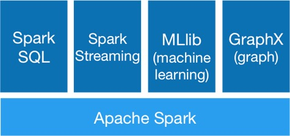

---
---
# Overview of Spark

::: tip Learning Objectives

- Learn basics about Scala programming language.
- Understand Spark RDD operations.
- Acquire hands-on experiences using Spark for analytics.

:::

In this chapter, you will learn about [Spark](http://spark.apache.org), an in-memory big data computing framework for parallel data processing and analytics. In this training we will illustrate several components of Spark ecosystem  through the interactive shell.

Spark is mainly developed with [Scala](http://www.scala-lang.org/), a functional programming language on JVM. Though most of the Spark functions also have Python and Java API, we will only present examples in Scala for its conciseness and simplicity. Interested students can learn more about Python and Java in Spark from the [official Spark document](https://spark.apache.org/docs/latest/programming-guide.html).

This chapter is divided into following sections:

1. **[Scala Basics](/spark/scala-basic.html)**: You will learn basic Scala syntax via interactive shell, including declaring variables of different types, making function calls as well as how to compile and run a standalone Scala program.
2. **[Spark Basics](/spark/spark-basic.html)**: You will learn how to load data into Spark and how to conduct some basic processing, e.g., converting data from raw string into a predefined class, filtering out those items with missing fields and statistics calculation. 
3. **[Spark SQL](/spark/spark-sql.html)**: You will learn how to use SQL like syntax for data processing in Spark. You will see how the data processing tasks can be achieved with Spark SQL.
4. **[Spark Application](/spark/spark-application.html)**: You will learn how to preprocess data using spark for predictive modeling. Specifically, you will setup patient features and target for later heart failure prediction using MLlib and using Scikit-learn (Python machine learning module).
5. **[Spark MLlib and Scikit-learn](/spark/spark-mllib.html)**: With the pre-processed data from the previous section, you will have a dataset suitable for Machine Learning tasks. In this section, you will learn how to apply existing algorithms in MLlib and in Scikit-learn to predict whether a patient will have heart failure. 
6. **[Spark GraphX](/spark/spark-graphx.html)**: GraphX is a Spark component for graph data processing. In this section, you will learn how to construct a graph and run graph algorithms such as PageRank, connected components on large graph.

<!-- 7. **[Spark Gotchas](/spark/spark-gotchas.html)**: There are a handful of FYIs when it comes to using Spark when operating in local mode versus clustered mode.  These gotchas can create perceived non-deterministic behaviors. -->
