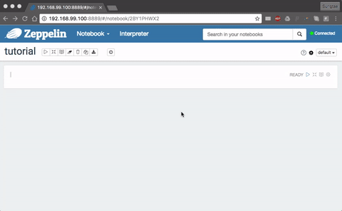
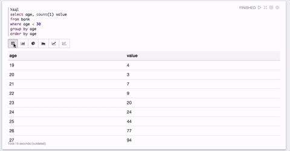

---
---
# Zeppelin Basic Tutorial

::: tip Learning Objectives

- Try to follow the official tutorial of Zeppelin Notebook step-by-step.

:::

## 1. Create a new Notebook

Click on 'Create new note', and give a name, click on 'Create Note':
Then, you will see a new blank note:


Next, click the gear icon on the top-right, interpreter binding setting will be unfolded.
Default interpreters will be enough for the most of cases, but you can add/remove at 'interpreter' menu if you want to. Click on 'Save' once you complete your configuration.



## 2. Basic usage

You can click the gear icon at the right side of the paragraph. If you click 'Show title' you can give a title as you want for each paragraph.
Try to use other commands also.


### Text note

Like other Notebooks, e.g. Jupyter, we can put some text in a paragraph by using `md` command with Markdown syntax:

```
%md
<some text using markdown syntax>
```

After put text, click `play button` or `Shift+Enter` to run the paragraph. It will show formatted Markdown text.
You can also choose show/hide editor for better visual or publishing.


### Scala code

If you bind default interpreters, you can use scala codes as well as Spark API directly in a paragraph:


Again, do not forget to click `play button` or `Shift+Enter` to actually run the paragraph.

#### Possible Error

If you meet an error related with HDFS, please check whether you have created HDFS user folder for 'zeppelin' as described in [Zeppelin-Intro](/spark/zeppelin-intro.html)

## 3. Load Data Into Table

We can use sql query statements for easier visualization with Zeppelin. Later, you can fully utilize Angular or D3 in Zeppelin for better or more sophisticated visualization.

Let's get 'Bank' data from the official Zeppelin tutorial.


Next, define a `case class` for easy transformation into `DataFrame` and map the text data we downloaded into DataFrame without its header. Finally, register this DataFrame as `Table` to use sql query statements.


## 4. Visualization of Data via SQL query statement

Once data is loaded into `Table`, you can use `SQL` query to visualize data you want to see:

```sql
%sql
<valid SQL statement>
```

Let's try to show a distribution of age of who are younger than 30.


As you can see, visualization tool will be automatically loaded once you run a paragraph with SQL statement. Default one is the result table of the query statement, but you can choose other types of visualization such as bar chart, pie chart and line chart by just clicking the icons.


Also, you can change configurations for each chart as you want

#### Input Form

You can create input form by using `${formName}` or `${formName=defaultValue}` templates.


#### Select Form

Also, you can create select form by using `${formName=defaultValue,option1|option2...}`


For more dynamic forms, please refer to [zeppelin-dynamicform](https://zeppelin.apache.org/docs/latest/manual/dynamicform.html)

## 5. Export/Import Notebook

Once you finish your works, you can export Notebook as JSON file for later use.


Also, you can import Notebook exported as JSON or from URL.


## Tutorial File

You can download the JSON file for this tutorial [here](https://gist.githubusercontent.com/yuikns/b7fc51a56e936e29f1577456c1b47563/raw/17d25875d7fd73eedaa67bc2f02e0a115110c233/tutorial.json) or see the official 'Zeppelin Tutorial' on the frontpage of Zeppelin.
